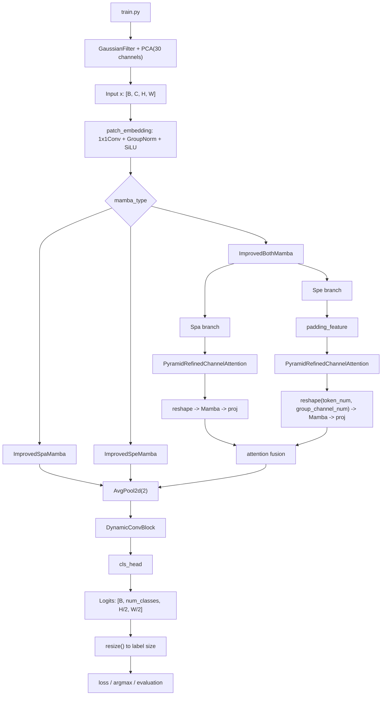

# HyPraMamba 模型架构梳理

## 1. 文档目标

这份文档用于梳理 `HyPyraMamba` 仓库中模型架构相关的代码位置、模块划分、前向流程，以及训练脚本如何调用模型。  
本仓库里真正定义网络结构的核心文件是 `model/MambaHSI.py`，训练入口在 `train.py`。

## 2. 代码位置总览

### 2.1 模型定义

- `HypraMamba/model/MambaHSI.py`

这个文件里定义了从底层注意力模块到顶层网络的全部核心组件，包括：

- `SCSA`
- `PyramidAttention`
- `PyramidRefinedChannelAttention`
- `MultiScaleConv`
- `DynamicConvBlock`
- `ChannelAttention`
- `ImprovedSpeMamba`
- `ImprovedSpaMamba`
- `ImprovedBothMamba`
- `ImprovedMambaHSI`

### 2.2 训练入口

- `HypraMamba/train.py`

这里负责：

- 读取数据
- PCA 降维
- 实例化 `ImprovedMambaHSI`
- 前向训练与验证
- 将模型输出插值回标签大小后计算损失与指标

### 2.3 损失和尺寸对齐

- `HypraMamba/utils/Loss.py`

这里的 `resize()` 和 `head_loss()` 用于把模型输出的低分辨率 logits 对齐到标签尺寸，再计算交叉熵损失。

## 3. 模型总览

仓库中训练时实际导入的是：

```python
from model.MambaHSI import ImprovedMambaHSI as MambaHSI
```

所以对外使用的模型名虽然叫 `MambaHSI`，但真正的实现类是 `ImprovedMambaHSI`。

顶层前向流程如下：

```text
输入高光谱图像
-> patch_embedding
-> Mamba 主分支（spa / spe / both）
-> AvgPool2d(2)
-> DynamicConvBlock
-> cls_head
-> 输出分类 logits
```

其中最重要的一点是：

- `ImprovedMambaHSI` 默认 `mamba_type='both'`
- 因此默认配置下，模型会同时走空间分支和光谱分支，再进行融合

## 4. 顶层网络：`ImprovedMambaHSI`

### 4.1 模块组成

`ImprovedMambaHSI` 的构成可以分成四层：

1. `patch_embedding`
2. `self.mamba`
3. `dynamic_conv`
4. `cls_head`

### 4.2 patch embedding

输入首先经过一个非常轻量的嵌入层：

- `1x1 Conv2d`：把输入通道映射到 `hidden_dim`
- `GroupNorm`
- `SiLU`

它的作用不是做 patch 切块，而是做通道投影，让后续 Mamba 分支在统一的隐藏维度上工作。

### 4.3 Mamba 主分支选择

`ImprovedMambaHSI` 支持三种模式：

- `mamba_type='spa'`：只走空间分支 `ImprovedSpaMamba`
- `mamba_type='spe'`：只走光谱分支 `ImprovedSpeMamba`
- `mamba_type='both'`：走双分支 `ImprovedBothMamba`

每种模式后面都接了一个：

- `AvgPool2d(kernel_size=2, stride=2)`

这意味着主干输出的空间尺寸会从 `H x W` 变成 `H/2 x W/2`。

### 4.4 dynamic conv

Mamba 主分支输出之后，不是直接进入分类头，而是先经过 `DynamicConvBlock`。

这个模块的作用是：

- 先用全局池化提取当前特征图的全局信息
- 生成多个 depthwise 卷积专家的权重
- 对多个卷积专家的输出进行加权融合

它本质上是一个动态卷积增强层，用来补充局部建模能力。

### 4.5 分类头

`cls_head` 很简单：

- `1x1 Conv2d(hidden_dim -> 128)`
- `GroupNorm`
- `SiLU`
- `1x1 Conv2d(128 -> num_classes)`

输出是每个像素位置的类别 logits。

注意：

- 由于前面做了 `AvgPool2d(2)`，这里输出的是低分辨率 logits
- 代码里虽然定义了 `Upsample(scale_factor=2)`，但 `forward()` 中并没有启用
- 实际训练和评估时，是在 `utils/Loss.py` 的 `resize()` 里统一插值回标签大小

## 5. 空间分支：`ImprovedSpaMamba`

### 5.1 结构组成

`ImprovedSpaMamba` 包含以下几个关键部分：

- `PyramidRefinedChannelAttention`
- `Mamba(d_model=channels)`
- `proj = GroupNorm + SiLU`
- 预留但当前未启用的 `MultiScaleConv`
- 预留但当前未启用的 `SCSA`

### 5.2 当前真实启用的路径

虽然构造函数里实例化了：

- `self.multi_scale_conv`
- `self.scsa`

但在 `forward()` 里，真正启用的是：

- `self.pyramid_refined_attention(x)`

也就是说，当前版本的空间分支实际流程是：

```text
x
-> PyramidRefinedChannelAttention
-> reshape 为 [B*H*W, 1, C]
-> Mamba
-> reshape 回 [B, C, H, W]
-> GroupNorm + SiLU
-> residual add
```

### 5.3 如何理解这个“空间分支”

这里的实现方式有一个容易误解的点。

`x_re` 会被 reshape 成：

- `[B * H * W, 1, C]`

这表示：

- 每个空间位置被看成一个样本
- 序列长度是 `1`
- 特征维度是 `C`

因此这条分支虽然被命名为“空间分支”，但它并不是在二维空间上显式扫描长序列；更准确地说，它是在每个像素位置上，对通道特征进行 Mamba 变换，并结合前面的多尺度注意力来强化空间相关信息。

### 5.4 残差连接

如果 `use_residual=True`，输出为：

- `x_recon + x`

这样可以保留原始输入信息，减轻深层变换带来的信息损失。

## 6. 光谱分支：`ImprovedSpeMamba`

### 6.1 设计目标

光谱分支的核心目标，是把高光谱通道按组切分后送入 `Mamba`，让模型在光谱维度上进行更结构化的建模。

### 6.2 关键参数

这个模块里有几个重要变量：

- `token_num`：分成多少组
- `group_channel_num = ceil(channels / token_num)`
- `channel_num = token_num * group_channel_num`

如果输入通道数不能整除 `token_num`，就需要补零到 `channel_num`。

### 6.3 padding 逻辑

`padding_feature()` 的作用是：

- 若原始通道数小于 `channel_num`
- 则在通道维补零
- 保证后续可以稳定 reshape 成 `token_num x group_channel_num`

这一步非常关键，因为后面的 Mamba 输入形状依赖这个分组结构。

### 6.4 前向流程

光谱分支当前流程是：

```text
x
-> padding_feature
-> PyramidRefinedChannelAttention
-> reshape 为 [B*H*W, token_num, group_channel_num]
-> Mamba(d_model=group_channel_num)
-> reshape 回 [B, C, H, W]
-> GroupNorm + SiLU
-> residual add
```

这里最核心的区别在于：

- 空间分支送入 Mamba 的序列长度是 `1`
- 光谱分支送入 Mamba 的序列长度是 `token_num`

因此光谱分支更明显地体现了“把通道分组后作为序列建模”的思想。

## 7. 双分支融合：`ImprovedBothMamba`

### 7.1 组成方式

`ImprovedBothMamba` 同时实例化：

- `self.spa_mamba = ImprovedSpaMamba(...)`
- `self.spe_mamba = ImprovedSpeMamba(...)`

也就是并行提取空间路径和光谱路径特征。

### 7.2 融合机制

两个分支的输出分别记为：

- `spa_x`
- `spe_x`

它们会先在通道维拼接，然后送入一个轻量注意力模块生成融合权重图：

- `Conv2d(2C -> C)`
- `SiLU`
- `Conv2d(C -> 1)`
- `Sigmoid`

得到的 `attention_map` 用来做互补加权：

- `spa_x_attended = spa_x * attention_map`
- `spe_x_attended = spe_x * (1 - attention_map)`

最后融合为：

- `fusion_x = spa_x_attended + spe_x_attended`

如果启用残差，再输出：

- `fusion_x + x`

### 7.3 作用理解

这个模块的思想可以理解为：

- 空间分支负责提取更偏空间结构的表示
- 光谱分支负责提取更偏光谱分组的表示
- 融合模块自适应决定当前位置更依赖哪一类信息

所以 `both` 模式是整个网络最完整的配置，也是默认配置。

## 8. 注意力与辅助模块

## 8.1 `PyramidAttention`

这是一个基础的二维注意力模块，主要流程是：

- `1x1 Conv` 生成 `Q/K/V`
- `3x3 depthwise conv` 做局部增强
- 按 head 重排
- 做归一化点积注意力
- `project_out` 输出

它是一个标准化的空间注意力单元，服务于更高层的金字塔注意力结构。

## 8.2 `PyramidRefinedChannelAttention`

尽管名字里带 `ChannelAttention`，但它的实现核心其实是多尺度的 `PyramidAttention` 堆叠。

它会：

- 对输入做多尺度下采样
- 每个尺度单独通过若干层 `PyramidAttention`
- 再上采样回原分辨率
- 沿通道拼接
- 最后用 `1x1 Conv` 融合

它的主要价值是：

- 同时捕获不同尺度的空间上下文
- 在不显著改变接口的情况下增强特征表达

这个模块是当前空间分支和光谱分支里都实际启用的关键预处理模块。

## 8.3 `DynamicConvBlock`

这个模块可以看成一组 depthwise 卷积专家的动态加权融合器。

流程如下：

- 输入先做 `AdaptiveAvgPool2d(1)`
- 两层 `1x1 Conv` 生成 `num_experts` 个 softmax 权重
- 每个专家都是一个 depthwise convolution
- 用 softmax 权重对多个专家输出加权求和
- 再经过 `GroupNorm + SiLU + Dropout`

它的作用是：

- 用较小代价提供动态局部建模能力
- 弥补纯状态空间模块对局部卷积偏置不足的问题

## 8.4 `ChannelAttention`

这是一个典型的 squeeze-excitation 风格通道注意力：

- 全局平均池化
- 两层 `1x1 Conv`
- `Sigmoid` 生成通道权重
- 与输入相乘

它当前主要被 `MultiScaleConv` 使用。

## 8.5 `MultiScaleConv`

`MultiScaleConv` 使用并行卷积核：

- `3x3`
- `5x5`
- `7x7`
- `1x1`

再把结果拼接、融合、归一化、激活，并接 `ChannelAttention`。

它的设计目标是提取多尺度局部特征。  
不过在当前版本的 `ImprovedSpaMamba.forward()` 中，这条路径被注释掉了，没有真正参与前向。

## 8.6 `SCSA`

`SCSA` 是一个更复杂的空间-通道自注意力模块，内部包含：

- 沿高和宽方向的统计与 depthwise 1D 卷积
- 水平和垂直注意力加权
- 下采样后的 `Q/K/V` 通道自注意力

它在代码里已经实现并在 `ImprovedSpaMamba` 中实例化，但当前前向中同样没有启用。

因此从“当前运行的真实架构”来看，`SCSA` 更像是一个保留模块或实验模块，而不是默认主干的一部分。

## 9. 训练脚本如何调用模型

## 9.1 数据预处理

在 `train.py` 中，输入数据会先经过：

1. 高斯滤波
2. PCA 降维到 `30` 个通道

然后构造输入：

- `x.shape = [1, channels, H, W]`

这里的 `channels` 实际上就是 PCA 后的通道数，通常为 `30`。

## 9.2 模型实例化

训练时模型是这样创建的：

```python
net = MambaHSI(in_channels=channels, num_classes=class_count, hidden_dim=128)
```

因此默认配置下：

- 输入通道数是 PCA 后的通道数
- 隐藏维度固定为 `128`
- 分类类别数由数据集决定
- `mamba_type` 没显式传参，所以使用默认值 `both`

## 9.3 训练与验证

训练阶段：

- `net(x)` 得到低分辨率 logits
- `head_loss()` 内部调用 `resize()`，把 logits 插值到标签大小
- 再计算交叉熵损失

验证和测试阶段同理，也是先：

- `output = net(x)`

再：

- `resize(output, size=label.shape[1:])`

然后：

- `argmax` 得到预测标签
- 送入 `Evaluator` 计算 OA、AA、Kappa、mIoU 等指标

## 10. 模型数据流图



## 11. 总结

`HyPyraMamba` 的模型代码并不分散，基本集中在 `model/MambaHSI.py` 一个文件中。  
从当前默认配置来看，模型可以概括为：

- 用 `patch_embedding` 统一输入通道表示
- 用双分支 Mamba 结构分别处理空间相关和光谱相关特征
- 用注意力机制进行分支融合
- 用动态卷积补充局部建模
- 最后通过轻量分类头输出像素级分类结果

如果只看“当前真正参与前向计算的模块”，主干重点是：

- `ImprovedMambaHSI`
- `ImprovedBothMamba`
- `ImprovedSpaMamba`
- `ImprovedSpeMamba`
- `PyramidRefinedChannelAttention`
- `DynamicConvBlock`

而 `MultiScaleConv` 和 `SCSA` 虽然已实现，但在当前版本默认前向里并没有被真正使用。
