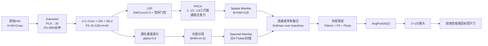

# PyS²CF-Mamba 预推免模型与论文答辩详解

> 论文：`PyS²CF-Mamba: A Pyramid Spatial–Spectral Competitive Fusion Mamba Network for Hyperspectral Image Classification`<br>
> 中文：`PyS²CF-Mamba：用于高光谱图像分类的金字塔空间–光谱竞争融合 Mamba 网络`<br>
> 论文材料：仓库根目录 `PyS2CF_Mamba_submission.zip`<br>
> 核心代码：`HypraMamba/model/MambaHSI.py`<br>
> 训练入口：`HypraMamba/train.py`<br>
> 整理日期：2026-08-11

---

## 0. 先看这一页：这份材料应该怎么用

这份文档不是论文的简单中文翻译，而是按“预推免老师会怎样追问”的方式，把论文、结构图、当前代码、训练日志和本地结果资产交叉核对后整理成的答辩材料。

如果需要对照`model/MambaHSI.py`逐行阅读，请配合：

```text
docs/MambaHSI源码逐行解读_对照PyS2CF-Mamba.md
```

建议按以下顺序复习：

1. 先背熟第 2 节的 30 秒、90 秒和 3 分钟介绍。
2. 再吃透第 5～12 节的实际代码数据流和张量形状。
3. 重点准备第 18 节的高频问答。
4. 面试前必须处理第 15 节列出的论文—代码—结果谱系问题。
5. 不确定时使用“论文明确写了什么、代码实际做了什么、我如何解释”三层口径，不要把合理推测说成论文事实。

### 证据标签

本文采用三类标签：

- **[论文]**：来自压缩包内 `PyS2CF-Mamba.tex`、PDF或论文结构图。
- **[代码]**：来自当前 `HypraMamba` 源码。
- **[本地证据]**：来自仓库中的日志、`mean_result.txt`、manifest或Git历史。

### 重要学术风险

> **面试前必须处理：当前论文表格与本地结果资产没有形成完整、唯一、可复现的谱系闭环。**
>
> 具体包括：LongKou论文数字与本地原始10-seed列表不一致；可追溯的LongKou full run使用的是更早的“多尺度可学习差分”代码，而不是论文所写的一阶差分；Qingyun和Tangdaowan论文消融表多行与本地表存在整齐的1.00个百分点偏移；部分消融还同时改变了dilation，不能视为严格单变量实验。
>
> 因此，本材料会同时列出“论文报告值”和“本地可核值”。在完成原始run追溯和表格重生成之前，不要把论文中的所有数值表述成“已经由当前仓库完整复现”。

---

## 1. 论文与代码版本边界

### 1.1 论文状态

压缩包中的PDF使用IEEE Geoscience and Remote Sensing Letters版式，PDF元数据创建时间为2026-07-09。它表现为投稿稿/模板稿，仅凭当前PDF不能对外声称“已经接收”或“已经发表”。

安全表述：

> 我围绕高光谱少样本分类完成了一篇PyS²CF-Mamba论文稿件，目前按IEEE GRSL格式组织。

除非你已经获得正式录用通知，否则不要说：

> 我的论文已经发表在IEEE GRSL。

### 1.2 论文名称与代码类名映射

| 论文概念 | 当前代码类或模块 |
|---|---|
| PyS²CF-Mamba | `ImprovedMambaHSI`，在训练入口中别名为`MambaHSI` |
| LPPS-Mamba | `ImprovedSpaMamba` |
| LSP | `LightSpatialPrior` |
| PRCA | `PyramidRefinedChannelAttention`和`PyramidAttention` |
| Spatial Mamba | `ImprovedSpaMamba.mamba` |
| DGS-Mamba | `ImprovedSpeMamba` |
| Channel-wise Competitive Fusion | `CompetitiveFusion` |
| 双分支与外层残差 | `ImprovedBothMamba` |
| Prediction Head | `ImprovedMambaHSI.cls_head` |

代码中仍保留早期`MambaHSI/Improved*`命名，没有把类名重命名成`PyS2CFMamba`。这属于工程命名遗留，不代表论文模型与代码完全无关。

### 1.3 当前代码比论文稿多出的后续工程功能

当前分支包含论文形成之后继续增加或修正的功能，例如：

- `spectral_fusion_scale`：控制融合结果向空间分支回缩，默认1.0时等价于论文主干。
- `checkpoint_tie_break=secondary`：解决验证OA并列时旧代码总选更晚epoch的问题。
- `evaluate_test=false`：支持仅用验证集筛选超参数，避免筛选阶段反复查看test。
- `gaussian_spectral_sigma`：允许空间平滑与光谱轴平滑解耦。
- TreeSpeciesHSI比赛适配。
- 可选`high_res_skip`，但论文主配置和当前默认均为`none`。

答辩时必须区分：

> 论文核心模型是什么；当前仓库为了后续实验和比赛又增加了哪些工程开关。

---

## 2. 三种时长的自我介绍话术

### 2.1 30秒版本

> 我的工作研究少样本高光谱图像分类。现有方法主要有三个矛盾：二维局部边缘与长程空间依赖难兼顾、光谱通道高度相关带来冗余、空间和光谱特征简单相加或拼接缺乏适应性。为此我设计了PyS²CF-Mamba：空间分支先用轻量局部先验和三尺度通道注意力补充二维结构，再用Mamba建模长程空间关系；光谱分支用潜在通道差分和分组Mamba建模组间依赖；最后对每个通道计算空间、光谱两分支的Softmax竞争权重。论文在LongKou、QUH-Qingyun和QUH-Tangdaowan上进行了少样本实验。

### 2.2 90秒版本

> 我做的是高光谱像素级分类。高光谱数据同时包含精细的光谱签名和二维空间结构，但在少样本条件下，CNN感受野有限，Transformer的空间自注意力代价高，普通Mamba把二维图像展平成一维序列后又可能削弱局部边缘。
>
> 我的模型先将高斯平滑、PCA到30维、百分位拉伸后的输入，通过1×1卷积映射到128维共享空间。之后采用空间—光谱双分支。空间分支LPPS-Mamba包括LSP、PRCA和Spatial Mamba：LSP用深度3×3卷积和单通道空间门控提取局部边缘；PRCA在原尺度、二分之一尺度和四分之一尺度上做通道注意力，避免构造HW乘HW的空间注意力矩阵；最后把特征按行展开为HW个token，用Mamba建模长程依赖。
>
> 光谱分支DGS-Mamba在128维潜在通道上做一阶差分引导的邻域变换，再把每个像素组织为4个32维token，用长度4的Mamba序列建模组间关系。两个分支最后不是直接相加，而是对每个通道计算一对和为1的竞争权重。融合后再加共享特征残差，池化、分类并上采样回标签分辨率。
>
> 这项工作的核心不是发明Mamba本身，而是围绕高光谱分类的三个具体问题，设计了“局部与多尺度先验注入—双域解耦建模—通道竞争融合”的完整信息流。

### 2.3 3分钟版本

> 高光谱图像有数百个连续窄波段，适合区分普通RGB中难以区分的地物，但标注成本高，因此少样本分类很重要。这个任务里有三个关键困难。第一，局部边界和大范围上下文都重要；CNN偏局部，Transformer全局建模代价高，而一维Mamba扫描可能破坏二维邻接。第二，相邻波段或潜在光谱响应高度相关，直接建模会有冗余。第三，空间和光谱特征是异构的，简单相加或拼接不能根据输入动态决定哪个分支更可靠。
>
> 因此，我提出PyS²CF-Mamba。输入先经过Gaussian、PCA 30维和2%到98%百分位拉伸，再通过1×1卷积、GroupNorm和SiLU得到128维共享特征F0。空间分支先经过LSP：深度3×3卷积提取局部纹理，一张由两层1×1卷积产生的空间门控图对这些响应进行筛选，然后残差加入F0。接着进入PRCA，分别在1、1/2、1/4三个尺度上构造分头通道注意力。每个头的注意力矩阵是32乘32，而不是像素数平方，因此对固定通道宽度而言，随像素数近似线性。PRCA输出再按行展开成B乘HW乘128的序列，进入单层Spatial Mamba。
>
> 光谱分支以每个像素为单位处理128维潜在通道。当前代码alpha为0.5，前127个通道做F_c加0.5乘F_{c+1}-F_c，最后一个通道保持不变；然后重排成BHW乘4乘32，Mamba沿4个组token扫描。这里我会谨慎说明：它不是直接对原始物理波长做差，而是在PCA和1×1嵌入后的潜在通道上做差分引导变换。
>
> 融合模块分别对两个分支做全局平均池化和独立线性层，形成B乘2乘128的logits，并沿两个分支做Softmax，所以每个通道的空间和光谱权重和为1。它是软竞争，不是硬选择；权重对每个tile和通道自适应，但同一通道在空间位置上共享。
>
> 当前代码还包含多层残差：LSP内部残差、空间Mamba残差、光谱Mamba残差和融合后的F0外残差。之后AvgPool2d降到一半分辨率，1×1分类头输出logits，再双线性插值回原分辨率。
>
> 论文报告在三个数据集上取得较高OA、AA和Kappa。不过我在复核时发现论文表格与当前本地结果资产尚未完全闭环，因此正式答辩前需要从原始10-seed日志重新生成所有表格并锁定对应Git版本。这也是我对科研可复现性的一点反思。

---

## 3. 问题背景：老师可能先从基础问起

### 3.1 什么是高光谱图像

普通RGB只有红、绿、蓝三个宽波段；高光谱图像通常包含几十到数百个连续、窄的光谱波段。每个像素不仅有二维位置，还对应一条随波长变化的光谱曲线。

可以把一幅高光谱图像写为：

$$
\mathbf X_{\mathrm{raw}}\in\mathbb R^{H\times W\times C_{\mathrm{raw}}}.
$$

其中：

- $H,W$为空间尺寸；
- $C_{\mathrm{raw}}$为原始波段数；
- 每个位置$(h,w)$都有一个$C_{\mathrm{raw}}$维光谱向量。

### 3.2 高光谱分类究竟输出什么

本项目不是“输入一个小patch，只输出中心像素类别”的传统patch分类，而是更接近语义分割的稠密像素分类：

$$
\hat{\mathbf Y}\in\{0,\ldots,K-1\}^{H\times W}.
$$

当前代码会对整个场景或重叠大tile产生像素级logits，训练损失只在有训练标签的位置计算。

### 3.3 为什么是少样本问题

高光谱像素的人工标注往往需要遥感和地学专家，成本高。论文采用：

- LongKou：每类30个训练像素、10个验证像素；
- Qingyun：每类100个训练像素、30个验证像素；
- Tangdaowan：每类100个训练像素、30个验证像素；
- 其余有标签像素作为测试。

这里的“少样本”是每类仅使用少量标注像素，不是元学习中的N-way K-shot episode，也不是跨任务few-shot adaptation。

### 3.4 CNN、Transformer和Mamba分别解决什么

| 方法 | 优势 | 主要问题 |
|---|---|---|
| CNN | 局部纹理、边缘先验强，计算成熟 | 固定卷积核和有限感受野不利于超长依赖 |
| Transformer | 全局关系显式，任意位置可直接交互 | 空间token注意力通常为$O(N^2)$，整图代价高 |
| RNN | 递归状态可建模序列 | 难并行、长序列训练困难 |
| Mamba/选择性SSM | 序列长度近似线性，可选择性传播状态 | 图像需序列化，单向扫描可能有方向偏置和二维结构损失 |

PyS²CF-Mamba不是简单选择其中一种，而是：

- 用卷积和门控补局部空间先验；
- 用通道注意力补多尺度上下文；
- 用Mamba处理长程空间和分组光谱序列；
- 用竞争融合协调双分支。

---

## 4. 一句话和一张图理解整个模型

### 4.1 一句话

> PyS²CF-Mamba先把输入投影到统一的128维潜在空间，再用LPPS-Mamba负责局部、多尺度和长程空间信息，用DGS-Mamba负责每个像素的潜在通道差分与分组依赖，最后通过逐通道Softmax竞争融合两个分支。

### 4.2 名称拆解

- **Py**：Pyramid，对应PRCA三尺度金字塔。
- **S²**：Spatial–Spectral，空间和光谱双分支。
- **CF**：Competitive Fusion，竞争融合。
- **Mamba**：两个分支均使用Mamba进行序列建模。

英文口头可读作：

> “Py S squared C F Mamba”

### 4.3 代码真实数据流



### 4.4 当前训练入口的关键配置

答辩时应以`train.py`实际传入的参数为准，而不是只看模型类的构造函数默认值。

| 配置 | 论文/当前主线实际值 |
|---|---:|
| PCA维度 | 30 |
| 共享隐藏维度 $D$ | 128 |
| GroupNorm组数 | 4 |
| 光谱token数 | 4 |
| 每个光谱token维度 | 32 |
| PRCA尺度数 | 3 |
| PRCA额外refinement层 | 2 |
| PRCA注意力头 | 4 |
| 实际dilation | 单一值3 |
| LSP reduction | 4 |
| Spatial Mamba | $d_{\mathrm{model}}=128,d_{\mathrm{state}}=16,d_{\mathrm{conv}}=4,\mathrm{expand}=2$ |
| Spectral Mamba | $d_{\mathrm{model}}=32,d_{\mathrm{state}}=16,d_{\mathrm{conv}}=4,\mathrm{expand}=2$ |
| 差分系数 | 0.5 |
| 融合缩放 | 1.0，论文主干不回缩 |
| 池化 | AvgPool2d(2) |
| 优化器 | Adam |
| 学习率 | $3\times10^{-4}$ |
| weight decay | $10^{-5}$ |
| epoch | 200 |
| label smoothing | 0.05 |
| seed | 0～9 |

容易混淆：

- `token_num=4`表示DGS的序列长度/分组数；
- `group_num=4`表示GroupNorm的组数。

二者当前数值相同，但语义完全不同。

---

## 5. 从输入到输出的完整张量形状

令一个输入tile为：

$$
\mathbf X\in\mathbb R^{B\times30\times H\times W}.
$$

当前默认$D=128$、token数$T=4$、每token维度$G=32$。

| 阶段 | 张量形状 | 含义 |
|---|---|---|
| PCA后输入 | $B\times30\times H\times W$ | 30个主成分 |
| 共享嵌入 $F_0$ | $B\times128\times H\times W$ | 空间、光谱分支共同输入 |
| LSP门控 | $B\times1\times H\times W$ | 所有通道共享的空间mask |
| LSP输出 $X_{\mathrm{prior}}$ | $B\times128\times H\times W$ | 注入局部边缘与纹理 |
| PRCA尺度1 | $B\times128\times H\times W$ | 细节尺度 |
| PRCA尺度1/2 | $B\times128\times\lfloor H/2\rfloor\times\lfloor W/2\rfloor$ | 中尺度 |
| PRCA尺度1/4 | $B\times128\times\lfloor H/4\rfloor\times\lfloor W/4\rfloor$ | 粗尺度 |
| Spatial Mamba输入 | $B\times(HW)\times128$ | 每个空间位置一个token |
| 空间分支输出 | $B\times128\times H\times W$ | $F_{\mathrm{spa}}$ |
| 差分特征 | $B\times128\times H\times W$ | $F_{\mathrm{diff}}$ |
| Spectral Mamba输入 | $(BHW)\times4\times32$ | 每个像素一条长度4的序列 |
| 光谱分支输出 | $B\times128\times H\times W$ | $F_{\mathrm{spe}}$ |
| 竞争logits | $B\times2\times128$ | 两分支、每通道一个logit |
| 竞争权重 | $B\times2\times128$ | 沿分支维Softmax |
| 融合输出 | $B\times128\times H\times W$ | $F_{\mathrm{fuse}}$ |
| 外层残差输出 | $B\times128\times H\times W$ | $F_0+F_{\mathrm{fuse}}$ |
| 池化后 | $B\times128\times\lfloor H/2\rfloor\times\lfloor W/2\rfloor$ | 分类头输入 |
| 模型原始logits | $B\times K\times\lfloor H/2\rfloor\times\lfloor W/2\rfloor$ | 半分辨率输出 |
| 插值后logits | $B\times K\times H\times W$ | 用于loss和最终预测 |

### 5.1 真实前向小样例

在当前环境对`[1,30,32,32]`输入做过实际前向检查：

```text
patch embedding      -> [1, 128, 32, 32]
LSP                  -> [1, 128, 32, 32]
PRCA                 -> [1, 128, 32, 32]
Spatial Mamba input  -> [1, 1024, 128]
Spectral Mamba input -> [1024, 4, 32]
F_spa                -> [1, 128, 32, 32]
F_spe                -> [1, 128, 32, 32]
F_fuse               -> [1, 128, 32, 32]
outer residual       -> [1, 128, 32, 32]
AvgPool2d(2)         -> [1, 128, 16, 16]
raw logits           -> [1, K, 16, 16]
```

### 5.2 对512×512 tile意味着什么

空间分支的序列为：

$$
[B,262144,128].
$$

光谱分支则为：

$$
[B\cdot262144,4,32].
$$

这说明：

- 空间Mamba的优势主要体现在能处理262144长度的空间序列；
- 光谱Mamba不是扫描128步，而是对每个像素扫描4个组token；
- 模型参数量虽小，但激活和空间序列非常大，运行代价不能只看0.88M参数。

---

## 6. Mamba和选择性状态空间模型基础

### 6.1 连续状态空间模型

经典连续SSM可写为：

$$
\frac{d\mathbf h(t)}{dt}
=\mathbf A\mathbf h(t)+\mathbf B\mathbf x(t),
$$

$$
\mathbf y(t)=\mathbf C\mathbf h(t)+\mathbf D\mathbf x(t).
$$

其中：

- $\mathbf x(t)$是输入；
- $\mathbf h(t)$是隐藏状态；
- $\mathbf y(t)$是输出；
- $\mathbf A$控制状态演化；
- $\mathbf B,\mathbf C$控制输入写入和状态读出；
- $\mathbf D$是直接通路。

离散化后可写为：

$$
\mathbf h_t
=\bar{\mathbf A}_t\mathbf h_{t-1}
+\bar{\mathbf B}_t\mathbf x_t,
$$

$$
\mathbf y_t
=\mathbf C_t\mathbf h_t+\mathbf D\mathbf x_t.
$$

### 6.2 Mamba为什么叫“选择性”

传统线性时不变SSM使用固定参数；Mamba让部分参数与当前输入相关，使网络可以根据内容选择性地：

- 保留重要状态；
- 遗忘无关信息；
- 控制当前输入写入隐藏状态的强度；
- 控制隐藏状态对输出的贡献。

当前项目直接调用`mamba_ssm.Mamba`，没有自行重新实现Selective Scan。

### 6.3 Mamba相对Transformer的复杂度口径

令序列长度为$N$、通道宽度为$D$：

- 标准空间自注意力的核心关系矩阵是$N\times N$，通常含$O(N^2D)$项；
- Mamba扫描对序列长度近似线性，可概括为$O(ND)$或在固定结构宽度下关于$N$线性。

但不要说：

> 整个PyS²CF-Mamba严格只有$O(N)$复杂度。

因为网络中的1×1卷积、QKV投影和通道注意力仍含$D^2$项。准确说法是：

> 它避免了空间token之间的$N^2$注意力，在固定通道宽度下，整体随像素数近似线性扩展。

### 6.4 当前空间Mamba的真实扫描方式

代码执行：

$$
[B,C,H,W]\rightarrow[B,H,W,C]\rightarrow[B,HW,C].
$$

因此是行优先光栅顺序：

1. 一行内从左到右；
2. 然后进入下一行；
3. 使用标准单向1D Mamba；
4. 不是四方向扫描，也不是专门的2D Selective Scan。

局限：

- 有方向偏置；
- 行尾到下一行行首在序列上相邻，但二维空间未必最近；
- LSP和PRCA只能缓解二维结构损失，不能完全消除。

---

## 7. 共享嵌入：为什么叫Patch Embedding但其实没有切patch

代码：

```text
Conv2d(30 -> 128, kernel_size=1)
GroupNorm(4, 128)
SiLU
```

公式可写为：

$$
\mathbf F_0
=\operatorname{SiLU}
\left(
\operatorname{GN}
\left(
\operatorname{Conv}_{1\times1}(\mathbf X)
\right)
\right).
$$

特点：

- 空间尺寸不变；
- 每个像素独立完成30维到128维的通道投影；
- 没有像ViT那样切成不重叠patch；
- 没有在这一层下采样。

如果老师问“patch size是多少”，准确回答：

> 代码里的名字沿用了Patch Embedding，但当前实现本质是1×1逐像素通道嵌入，patch size可以理解为1，不做空间切块。

为什么用GroupNorm：

- 当前通常`B=1`或小batch；
- BatchNorm的批统计不稳定；
- GroupNorm不依赖batch维统计，更适合整图或大tile少样本训练。

---

## 8. LPPS-Mamba：空间分支详细拆解

LPPS-Mamba全称Local-Prior Pyramid Spatial Mamba。

它的设计顺序是：

> 局部二维先验注入 → 多尺度上下文与通道关系 → 长程空间扫描

这个顺序很重要。先让特征携带局部二维结构，再序列化进入Mamba，比扫描完成后再补边缘更符合“先保护结构、再做全局传播”的设计逻辑。

### 8.1 LSP：Lightweight Spatial Prior

#### 8.1.1 两条路径

局部路径：

$$
\mathbf F_{\mathrm{local}}
=\operatorname{DWConv}_{3\times3}(\mathbf F_0).
$$

门控路径：

$$
\mathbf G_{\mathrm{spa}}
=\operatorname{Sigmoid}
\left(
\operatorname{Conv}_{1\times1}^{32\rightarrow1}
\left(
\operatorname{SiLU}
\left(
\operatorname{Conv}_{1\times1}^{128\rightarrow32}(\mathbf F_0)
\right)
\right)
\right).
$$

门控形状：

$$
\mathbf G_{\mathrm{spa}}\in\mathbb R^{B\times1\times H\times W}.
$$

这是一张所有通道共享的空间门控图，不是128张独立mask。

输出：

$$
\mathbf X_{\mathrm{prior}}
=\mathbf F_0+
\operatorname{SiLU}
\left[
\operatorname{GN}
\left(
\operatorname{Conv}_{1\times1}
\left(
\mathbf F_{\mathrm{local}}\odot\mathbf G_{\mathrm{spa}}
\right)
\right)
\right].
$$

#### 8.1.2 为什么用深度卷积

普通3×3卷积的参数量近似：

$$
9D^2.
$$

深度3×3卷积近似：

$$
9D.
$$

它以较低参数量提取每个通道内的局部边缘和纹理，后续1×1卷积再完成通道混合。

#### 8.1.3 门控的作用

门控不是简单增强所有局部响应，而是根据当前输入产生空间重要性：

- 边界、纹理变化明显处可以得到更高响应；
- 均匀或噪声区域可以被压制；
- Sigmoid输出在0到1之间；
- mask在通道间共享，参数较少，但表达能力也弱于逐通道空间门控。

#### 8.1.4 LSP残差的作用

$$
\mathbf X_{\mathrm{prior}}=\mathbf F_0+\mathcal L(\mathbf F_0).
$$

它可以：

- 防止局部滤波破坏基础光谱—空间表征；
- 改善梯度传播；
- 允许网络在局部模块无益时接近恒等映射。

### 8.2 PRCA：Pyramid Refined Channel Attention

#### 8.2.1 三尺度

当前代码使用：

$$
s\in\{1,\tfrac12,\tfrac14\}.
$$

对应：

- 原尺度：保留边缘与精细结构；
- 1/2尺度：扩大有效感受野；
- 1/4尺度：提供粗粒度区域和更大上下文。

低尺度由平均池化获得，处理后再双线性上采样回原尺寸。

#### 8.2.2 当前实际不是“每尺度两层”

`prca_num_layers=2`容易被误解。代码每个尺度创建：

- 1个基础`attention_module`；
- 2个额外`attention_layers`。

所以：

$$
1+2=3\ \text{个PyramidAttention/尺度},
$$

$$
3\ \text{尺度}\times3=9\ \text{个独立PyramidAttention block}.
$$

九个block不共享参数。

#### 8.2.3 单个PyramidAttention内部

以$D=128$、4头为例：

1. 1×1卷积产生384通道QKV；
2. dilation=3的深度3×3卷积增强局部上下文；
3. 切分为Q、K、V，各128通道；
4. 重排成：

$$
[B,4,32,N_s],
$$

其中$N_s=H_sW_s$；
5. Q、K沿空间维$N_s$做$L_2$归一化；
6. 计算：

$$
\mathbf A_s
=\operatorname{Softmax}
\left(
\tau_s\bar{\mathbf Q}_s\bar{\mathbf K}_s^T
\right).
$$

每头注意力矩阵为：

$$
32\times32,
$$

不是：

$$
N_s\times N_s.
$$

7. 计算$\mathbf A_s\mathbf V_s$，恢复空间形状并做1×1输出投影。

#### 8.2.4 为什么对通道做注意力

普通整图空间注意力需要构造：

$$
[N_s,N_s].
$$

PRCA构造的是分头通道关系：

$$
[D/h,D/h].
$$

其核心复杂度可概括为：

$$
O(N_sD^2/h),
$$

而不是：

$$
O(N_s^2D).
$$

当$N_s\gg D$时，这非常重要。

#### 8.2.5 $L_2$归一化与温度

- $L_2$归一化使Q、K内积更接近余弦相似度；
- 可学习温度$\tau_s$控制Softmax分布的平或尖；
- 代码中每个PyramidAttention都有独立温度，形状为`[4,1,1]`。

#### 8.2.6 多尺度融合

三尺度结果上采样后拼接：

$$
\left[
\hat{\mathbf X}_{1},
\operatorname{Up}(\hat{\mathbf X}_{1/2}),
\operatorname{Up}(\hat{\mathbf X}_{1/4})
\right]
\in\mathbb R^{B\times384\times H\times W}.
$$

再通过1×1卷积压回128维：

$$
\mathbf F_{\mathrm{PRCA}}\in
\mathbb R^{B\times128\times H\times W}.
$$

#### 8.2.7 dilation的准确口径

模型类默认写有`pyramid_dilation=(2,3)`，但`train.py`实际传入字符串`"3"`。

所以论文主训练路径当前实际使用的是：

> 单一dilation=3。

不是：

> 同时融合dilation 2和3。

如果直接按类默认值实例化，代码才会启用多个dilation并学习全局Softmax权重。

### 8.3 Spatial Mamba

PRCA输出按行优先展开：

$$
\mathbf F_{\mathrm{PRCA}}
\in\mathbb R^{B\times128\times H\times W}
\rightarrow
\mathbf T_{\mathrm{spa}}
\in\mathbb R^{B\times HW\times128}.
$$

当前Mamba参数：

- `d_model=128`；
- `d_state=16`；
- `d_conv=4`；
- `expand=2`；
- 内部扩展维度256；
- 当前库自动`dt_rank=8`。

输出恢复为二维后经过GN和SiLU，并加入LSP输出：

$$
\mathbf F_{\mathrm{spa}}
=
\operatorname{SiLU}
\left(
\operatorname{GN}
\left(
\operatorname{Reshape}
\left(
\operatorname{Mamba}(\mathbf T_{\mathrm{spa}})
\right)
\right)
\right)
+\mathbf X_{\mathrm{prior}}.
$$

注意：

- 残差加的是$\mathbf X_{\mathrm{prior}}$，不是裸$\mathbf F_0$；
- $\mathbf X_{\mathrm{prior}}$本身已经包含一次$\mathbf F_0$残差；
- 因此空间分支中的基础信息保留较强。

---

## 9. DGS-Mamba：光谱分支详细拆解

DGS-Mamba全称Differential Grouped Spectral Mamba。它不是在空间维上扫描，而是把每个像素的潜在通道组织成一个很短的序列，依次完成：

1. 潜在通道一阶差分引导；
2. 通道分组与token化；
3. Spectral Mamba组间状态传播；
4. 归一化、激活和残差恢复。

### 9.1 差分发生在哪里

输入不是原始高光谱立方体，而是共享嵌入：

$$
\mathbf F_0\in\mathbb R^{B\times128\times H\times W}.
$$

真实顺序为：

$$
\text{原始波段}
\rightarrow\text{Gaussian}
\rightarrow\text{PCA 30维}
\rightarrow\text{1×1可学习投影到128维}
\rightarrow\text{差分}.
$$

所以，当前差分对象是**潜在通道**，而不是仍按物理波长顺序排列的原始相邻波段。

预推免安全表述：

> DGS的设计动机来自相邻光谱响应的变化，但当前实现是在PCA和可学习嵌入后的潜在通道上进行邻域差分。它保留了光谱来源和任务相关性，却不再具有严格的原始波长邻接含义。

不要表述为：

> 我的代码直接计算了原始相邻波段的一阶导数。

### 9.2 一阶差分的代码与公式

代码对前127个通道计算：

$$
\Delta\mathbf F_0^{(c)}
=\mathbf F_0^{(c+1)}-\mathbf F_0^{(c)},
\qquad c=1,\ldots,127.
$$

最后一个通道的差分置零。增强后的特征为：

$$
\mathbf F_{\mathrm{diff}}^{(c)}
=\mathbf F_0^{(c)}
+\alpha\Delta\mathbf F_0^{(c)}.
$$

当前训练入口固定：

$$
\alpha=0.5.
$$

因此对前127个通道：

$$
\begin{aligned}
\mathbf F_{\mathrm{diff}}^{(c)}
&=\mathbf F_0^{(c)}
+0.5\left(
\mathbf F_0^{(c+1)}-\mathbf F_0^{(c)}
\right)\\
&=0.5\mathbf F_0^{(c)}
+0.5\mathbf F_0^{(c+1)}.
\end{aligned}
$$

最后一个通道保持：

$$
\mathbf F_{\mathrm{diff}}^{(128)}
=\mathbf F_0^{(128)}.
$$

这带来一个必须诚实说明的数学事实：

> 当$\alpha=0.5$时，这一步数值上更像相邻潜在通道的平均或线性插值，而不是只提取高频差分。

“差分增强”仍可作为结构来源，但不要过度声称它必然放大高频。若老师追问为什么仍有意义，可以回答：

> 它用相邻潜在响应重构当前通道，使后续分组Mamba看到一种带邻域变化引导的表示；同时原值没有被完全抛弃，因此比纯差分更稳定。当前$\alpha$没有做系统敏感性实验，这是可以继续完善的地方。

### 9.3 分组和token化

当前参数为：

- 通道数$D=128$；
- token数$T=4$；
- 每个token维度$G=\lceil128/4\rceil=32$；
- $128$恰好能被$4$整除，因此当前主配置不需要补零。

张量变化为：

$$
[B,128,H,W]
\rightarrow[B,H,W,128]
\rightarrow[BHW,4,32].
$$

以512×512单tile为例：

$$
[1,128,512,512]
\rightarrow[262144,4,32].
$$

准确解释：

- $BHW$被视为Spectral Mamba的批次维；
- 每个空间位置独立形成一条光谱组序列；
- 序列长度只有4；
- 每个序列位置是一个32维token；
- 不是4个Mamba并行处理4组，而是一个Mamba沿4个组token依次扫描。

### 9.4 论文正文、Fig. 3与代码的符号裁决

论文正文把DGS张量写成：

$$
\mathbb R^{BHW\times G\times(D/G)}.
$$

Fig. 3又画成：

$$
[BHW,T,G],
$$

并标注沿$T$扫描。两处对token数和token维度的符号使用不完全一致。

当前代码给出的唯一确定答案是：

$$
\boxed{[BHW,4,32]}
$$

即：

- 扫描长度$T=4$；
- Mamba的`d_model=32`；
- 当前不存在“沿32步扫描，每步4维”的行为。

答辩时若老师指出图文符号不一致，建议回答：

> 这是论文符号定义需要统一的地方。以当前实现为准，序列长度是4，每个token维度是32；我会在最终稿中统一正文和结构图的$T,G$定义。

### 9.5 Spectral Mamba参数与残差

当前Spectral Mamba参数为：

- `d_model=32`；
- `d_state=16`；
- `d_conv=4`；
- `expand=2`；
- 内部扩展维度64；
- 当前库自动`dt_rank=2`。

Mamba前后形状保持：

$$
[BHW,4,32]\rightarrow[BHW,4,32].
$$

随后恢复到：

$$
[B,128,H,W],
$$

再经GroupNorm和SiLU。

当前代码最终计算：

$$
\mathbf F_{\mathrm{spe}}
=
\operatorname{SiLU}
\left[
\operatorname{GN}
\left(
\operatorname{Reshape}
\left(
\operatorname{Mamba}(\mathbf T_{\mathrm{spe}})
\right)
\right)
\right]
+\mathbf F_{\mathrm{diff}}.
$$

### 9.6 论文式(7)与代码残差不一致

论文式(7)写的是：

$$
\mathbf F_{\mathrm{spe}}
=\operatorname{MambaOutput}+\mathbf F_0.
$$

当前代码实际是：

$$
\mathbf F_{\mathrm{spe}}
=\operatorname{MambaOutput}+\mathbf F_{\mathrm{diff}}.
$$

这不是符号小问题，因为残差基底不同：

- 加$\mathbf F_0$：保证未经差分的共享特征直接保留；
- 加$\mathbf F_{\mathrm{diff}}$：差分引导特征同时走主路径与残差路径，差分作用更强。

面试前必须决定以哪个版本作为最终模型，并统一：

1. 论文公式；
2. 结构图；
3. 代码；
4. 对应实验结果。

在尚未统一前，答辩应说：

> 论文公式写的是加$F_0$，当前代码实现加的是$F_{\mathrm{diff}}$。如果以当前代码为最终实现，论文式(7)需要修订。

### 9.7 为什么序列长度只有4还要用Mamba

这是老师很可能提出的尖锐问题。诚实分析如下：

- Mamba擅长长序列，但当前光谱序列只有4；
- 因此DGS分支无法主要依靠“超长序列效率”来证明合理性；
- 它更像一个带输入选择机制和状态传播的组间混合器；
- 真正的长序列优势主要发生在Spatial Mamba的$HW$维。

可回答：

> 我在光谱分支使用Mamba，不是因为4个token本身很长，而是希望用与空间分支统一的选择性状态传播机制学习四个潜在光谱组之间的有序依赖。这个设计的必要性仍应通过与MLP、1D卷积或轻量注意力的等参数对照进一步验证。

这比笼统说“光谱序列很长，所以必须用Mamba”更经得起追问。

---

## 10. 竞争融合、完整残差和分类头

### 10.1 为什么不能只把两个分支相加

空间分支和光谱分支关注的信息不同：

- $\mathbf F_{\mathrm{spa}}$：局部边缘、多尺度上下文和长程空间关系；
- $\mathbf F_{\mathrm{spe}}$：单像素潜在通道的差分和组间依赖。

若直接固定相加，默认所有通道都应等量使用两个分支。PyS²CF-Mamba希望让网络根据当前输入，在每个通道上决定更依赖哪一支。

### 10.2 竞争权重怎样产生

两分支输入均为：

$$
\mathbf F_{\mathrm{spa}},
\mathbf F_{\mathrm{spe}}
\in\mathbb R^{B\times128\times H\times W}.
$$

分别经过全局平均池化：

$$
\operatorname{GAP}(\mathbf F)
\in\mathbb R^{B\times128}.
$$

随后各自通过一个不带bias的独立线性层：

$$
\mathbf Z_{\mathrm{spa}}
=\mathbf W_{\mathrm{spa}}^{\mathrm{fc}}
\operatorname{GAP}(\mathbf F_{\mathrm{spa}}),
$$

$$
\mathbf Z_{\mathrm{spe}}
=\mathbf W_{\mathrm{spe}}^{\mathrm{fc}}
\operatorname{GAP}(\mathbf F_{\mathrm{spe}}).
$$

堆叠为：

$$
\mathbf Z\in\mathbb R^{B\times2\times128}.
$$

沿“两个分支”这一维做Softmax：

$$
\left[
w_{\mathrm{spa}}^{(c)},
w_{\mathrm{spe}}^{(c)}
\right]
=\operatorname{Softmax}
\left(
\left[
z_{\mathrm{spa}}^{(c)},
z_{\mathrm{spe}}^{(c)}
\right]
\right).
$$

因此对每个通道$c$：

$$
w_{\mathrm{spa}}^{(c)}
+w_{\mathrm{spe}}^{(c)}=1,
\qquad
w_{\mathrm{spa}}^{(c)},w_{\mathrm{spe}}^{(c)}\ge0.
$$

融合为：

$$
\mathbf F_{\mathrm{fuse}}
=
\mathbf W_{\mathrm{spa}}\odot\mathbf F_{\mathrm{spa}}
+
\mathbf W_{\mathrm{spe}}\odot\mathbf F_{\mathrm{spe}}.
$$

### 10.3 “逐通道自适应”不等于“逐像素自适应”

当前竞争权重的粒度是：

$$
[B,2,128,1,1].
$$

也就是说：

- 每个输入tile不同；
- 每个通道不同；
- 空间和光谱两分支相互竞争；
- 但同一tile内，同一通道在所有$(h,w)$位置共享同一个权重。

准确口径：

> 这是每tile、每通道的全局竞争融合，不是每个像素独立选择空间或光谱分支。

它的优势是参数少、稳定、不会扩大通道数；局限是不能让同一通道在边界区偏空间、在区域内部偏光谱。

### 10.4 竞争融合与普通门控的区别

若两个分支分别使用Sigmoid门控，它们可能同时接近1或同时接近0。当前Softmax满足权重和为1，因此存在显式资源分配：

- 空间权重增加时，光谱权重相对下降；
- 融合是两个分支的通道级凸组合；
- 它是软竞争，不是离散硬路由。

### 10.5 `wo_competitive`真实做了什么

论文消融文字说用direct addition替代竞争融合。当前代码实际计算：

$$
\mathbf F_{\mathrm{fuse}}
=0.5\left(
\mathbf F_{\mathrm{spa}}
+\mathbf F_{\mathrm{spe}}
\right).
$$

因此它是**简单平均**，不是不缩放的直接相加。

两者虽然只差一个常数系数，但当前融合后没有立刻进行归一化，所以不能在所有情况下说完全等价。论文消融名称和实现应统一成：

> replace competitive fusion with equal-weight averaging

或把代码改成论文定义后重新实验。

### 10.6 `spectral_fusion_scale`是后续扩展开关

当前代码支持：

$$
\mathbf F'_{\mathrm{fuse}}
=\mathbf F_{\mathrm{spa}}
+\beta\left(
\mathbf F_{\mathrm{fuse}}-\mathbf F_{\mathrm{spa}}
\right),
\quad0<\beta\le1.
$$

解释：

- $\beta=1$：保持原竞争融合；
- $\beta<1$：让结果向空间分支回缩，减弱光谱分支影响。

论文主配置和当前默认均为：

$$
\beta=1.
$$

所以该开关不是论文核心创新，应作为后续工程扩展介绍，不能拿来解释论文主表。

### 10.7 融合后的外层残差

当前默认`outer_residual_mode=standard`，因此：

$$
\mathbf F_{\mathrm{block}}
=\mathbf F_0+\mathbf F_{\mathrm{fuse}}.
$$

这条残差在Fig. 1中画出，但论文正文公式没有完整写入。它的作用是：

- 给两分支融合结果提供稳定的共享特征基底；
- 缩短反向传播路径；
- 在空间或光谱分支不稳定时保留嵌入信息；
- 让融合模块更像学习相对$\mathbf F_0$的修正量。

### 10.8 当前默认模型的完整残差清单

| 序号 | 残差位置 | 当前公式 |
|---:|---|---|
| 1 | LSP内部 | $\mathbf X_{\mathrm{prior}}=\mathbf F_0+\operatorname{LSPTransform}(\mathbf F_0)$ |
| 2 | Spatial Mamba后 | $\mathbf F_{\mathrm{spa}}=\mathbf X_{\mathrm{prior}}+\operatorname{SpaTransform}(\mathbf F_{\mathrm{PRCA}})$ |
| 3 | Spectral Mamba后 | $\mathbf F_{\mathrm{spe}}=\mathbf F_{\mathrm{diff}}+\operatorname{SpeTransform}(\mathbf T)$ |
| 4 | 双分支融合后 | $\mathbf F_{\mathrm{block}}=\mathbf F_0+\mathbf F_{\mathrm{fuse}}$ |

当前还有两个非论文默认扩展：

- `high_res_skip=patch/pre_pool`：池化后再加入高分辨率skip；默认`none`。
- `outer_residual_mode=scaled`：给外残差乘可配置系数；默认`standard`。

注意：

> `use_residual=False`并不会关闭LSP内部固定存在的`out+x`，所以它不等于“模型完全没有残差”。

### 10.9 池化与分类头

融合块输出后执行：

```text
AvgPool2d(2)
→ Conv1×1(128→128)
→ GroupNorm(4,128)
→ SiLU
→ Conv1×1(128→K)
```

因此：

$$
[B,128,H,W]
\rightarrow
[B,128,\lfloor H/2\rfloor,\lfloor W/2\rfloor]
\rightarrow
[B,K,\lfloor H/2\rfloor,\lfloor W/2\rfloor].
$$

模型本体输出的是半分辨率logits，随后由训练或推理脚本双线性插值回标签大小。

### 10.10 为什么pool后边界不一定完全糊掉

可以从四点回答：

1. 池化发生在经过LSP、PRCA、双Mamba和多层残差之后，特征已经包含边界与上下文；
2. LSP显式使用3×3深度卷积和空间门控保留局部变化；
3. 分类头是在高层语义特征上降采样，不是直接对原始标签做平均；
4. 插值恢复会产生平滑边界，但最终像素类别仍由多通道logits竞争决定。

同时必须承认：

> 半分辨率预测确实可能损害一像素宽的小目标和精细边界。当前没有专门的边界损失、解码器或定量边界指标，这是模型的限制。

### 10.11 训练和推理的插值设置不一致

训练loss恢复分辨率时使用：

```python
align_corners=False
```

验证和测试恢复分辨率时使用：

```python
align_corners=True
```

这会造成几何采样规则的轻微不一致。它未必显著改变指标，但属于应修正的工程细节。推荐统一成`False`并重新核验结果。

---

## 11. 数据、划分、预处理和tile训练协议

### 11.1 三个论文数据集

| 数据集 | 场景尺寸 | 原始波段 | 类别数 | 每类训练 | 每类验证 |
|---|---:|---:|---:|---:|---:|
| WHU-Hi-LongKou | $550\times400$ | 270 | 9 | 30 | 10 |
| QUH-Qingyun | $880\times1360$ | 176 | 6 | 100 | 30 |
| QUH-Tangdaowan | $1740\times860$ | 176 | 18 | 100 | 30 |

其余有标签像素用于测试。这里“每类100个训练样本”指100个标注像素，不是100幅独立图像。

### 11.2 Gaussian平滑

当前默认调用三维Gaussian：

$$
\sigma=(1.0,1.0,1.0).
$$

也就是同时沿：

- 高度$H$；
- 宽度$W$；
- 光谱轴$C$

进行平滑。

作用：

- 降低空间噪声和孤立响应；
- 缓和光谱方向高频噪声；
- 给差分分支提供更稳定输入。

风险：

- 空间平滑会跨训练、验证、测试像素边界传播无标签特征；
- 光谱平滑可能削弱窄吸收特征；
- 论文没有Gaussian核或$\sigma$敏感性实验。

### 11.3 PCA如何拟合

代码把完整场景展开：

$$
[H,W,C_{\mathrm{raw}}]
\rightarrow[HW,C_{\mathrm{raw}}],
$$

然后在全部$HW$像素上拟合PCA并降到30维：

$$
[HW,C_{\mathrm{raw}}]
\rightarrow[HW,30].
$$

当前特征：

- 不做PCA whitening；
- PCA前没有逐波段z-score标准化；
- 使用场景内全部像素，包括背景和test区域；
- 不使用任何类别标签。

PCA的作用是全局无监督线性压缩，DGS则是端到端任务相关的潜在通道建模。二者并非完全重复，但PCA使“相邻通道=相邻物理波长”的解释不再成立。

### 11.4 百分位拉伸与8 bit量化

每个PCA分量独立计算2%和98%分位数：

$$
p_2^{(c)},p_{98}^{(c)}.
$$

然后：

$$
\tilde x^{(c)}
=\operatorname{clip}
\left(
\frac{x^{(c)}-p_2^{(c)}}
{p_{98}^{(c)}-p_2^{(c)}},
0,1
\right).
$$

真实工程流程还包含：

$$
[0,1]\rightarrow[0,255]\rightarrow\text{uint8}
\rightarrow\text{ToTensor}\rightarrow\text{float32}[0,1].
$$

也就是说，中间发生一次8 bit量化。论文只概括为百分位拉伸和归一化，没有写出这一量化步骤。

潜在风险：

- 极少数情况下若$p_2=p_{98}$，当前实现没有显式epsilon；
- 量化会丢失部分连续精度；
- 全场景分位数同样使用了test区域的无标签分布。

### 11.5 标签图和`ignore_index=-1`

原始标签通常为：

- 0：背景或无标签；
- 1到$K$：真实类别。

训练、验证、测试各自生成一张$[H,W]$标签图：

- 该split选中的位置：类别减1，映射到$0,\ldots,K-1$；
- 其他所有位置：映射为$-1$；
- CrossEntropy通过`ignore_index=-1`忽略。

因此：

> 网络前向会处理tile中的所有像素，但只有训练split的标注位置产生训练监督。

### 11.6 固定划分与随机划分

- LongKou论文设置按seed进行每类随机采样；
- QUH-Qingyun和QUH-Tangdaowan使用仓库中的固定split；
- 同一个像素不能同时进入train、val和test标签集合；
- 但三个集合仍位于同一连续场景，未做严格的空间块隔离。

空间自相关意味着相邻像素通常非常相似。因此随机像素split可能比跨区域、跨场景的归纳式评估更容易。答辩中不要把结果推广为“对未知地区一定泛化”。

### 11.7 当前类别权重

训练代码支持balanced class weights和手工倍数，但当前论文主线资产中的各类乘数均为1，等价于普通label-smoothing CrossEntropy，没有人为提高某个类别损失权重。

### 11.8 为什么说当前不是传统小patch分类

传统中心像素patch范式是：

$$
\text{小邻域patch}\rightarrow\text{一个中心像素标签}.
$$

当前范式是：

$$
\text{完整场景或大tile}
\rightarrow\text{同尺寸稠密标签图}.
$$

这使模型能利用大范围上下文，但也意味着训练时会接触同一场景中未标注区域的特征。

### 11.9 whole-image与tile的准确口径

旧LongKou实验可整图处理；当前统一入口默认`tile_size=512`。三个数据集实际tile数为：

| 数据集 | tile数 | y方向起点 | x方向起点 |
|---|---:|---|---|
| LongKou | 2 | $[0,38]$ | $[0]$ |
| Qingyun | 6 | $[0,368]$ | $[0,480,848]$ |
| Tangdaowan | 8 | $[0,480,960,1228]$ | $[0,348]$ |

更准确的论文口径是：

> 模型采用非中心像素小patch的稠密语义分割式设计；对大场景使用重叠大tile训练和推理。

不要笼统说：

> 所有实验都是整幅图一次送入模型。

### 11.10 tile重叠和边缘

默认：

- tile size 512；
- nominal overlap 32；
- 常规步长480；
- 最后一个tile会贴齐边界，因此实际重叠可能大于32。

这样做可以：

- 降低整图显存；
- 给tile边界像素提供来自相邻tile的第二次观察；
- 推理时对重叠logits平均，减轻接缝。

### 11.11 一个epoch到底更新几次

训练不是“每个tile立即step”，也不是简单“每2个tile更新一次”。真实流程：

1. 只保留含训练标注像素的tile；
2. 按有效标注像素数贪心分成`tile_update_groups=2`组；
3. 每组内对所有tile累计梯度；
4. 组内loss按有效训练像素数加权；
5. 每组结束执行一次`optimizer.step()`。

所以通常每个epoch约有2次参数更新。

这个设计使不同tile中极不均衡的训练标注数得到更合理权重，但也意味着200 epochs对应的优化step数量远小于“200×tile数”。

### 11.12 重叠区域如何处理

训练时：

- 同一训练像素若落在多个重叠tile中，可能重复参与loss；
- 这相当于对边界附近像素增加采样频率；
- 当前未对重复次数做反权重校正。

推理时：

- 每个tile输出先插值到tile大小；
- 重叠区域逐类logits累加；
- 再除以覆盖次数；
- 最后对平均logits做argmax。

因此不是对多个tile的离散类别投票，而是对分类logits等权平均。

### 11.13 是否存在数据泄漏

必须分两层回答。

**没有发现test-label泄漏：**

- test标签不参与训练loss；
- checkpoint主要依据validation指标选择；
- 训练标签掩码与test标签掩码分开。

**但存在transductive完整场景上下文：**

- Gaussian对完整场景做平滑；
- PCA在完整场景全部像素拟合；
- 百分位统计使用完整场景；
- 训练tile中的未标注val/test像素特征会进入卷积、PRCA和Mamba；
- split没有做空间隔离。

最准确的答辩说法是：

> 当前没有使用验证或测试标签训练，但使用了完整场景的无标签分布和上下文，因此属于transductive full-scene/tiled protocol，而不是严格的inductive unseen-scene protocol。

---

## 12. 优化、损失、验证与checkpoint选择

### 12.1 训练超参数

论文主线当前入口为：

| 项目 | 设置 |
|---|---:|
| optimizer | Adam |
| learning rate | $3\times10^{-4}$ |
| weight decay | $1\times10^{-5}$ |
| scheduler | none |
| epochs | 200 |
| label smoothing | 0.05 |
| seeds | 0～9 |
| tile update groups | 2 |

当前没有：

- Dropout；
- DropPath；
- 显式数据增强；
- early stopping；
- 余弦退火或step scheduler；
- 边界损失、Dice loss或对比损失。

### 12.2 Label-smoothing CrossEntropy

对真实类别$y$，普通one-hot目标被平滑为：

$$
q_k=
\begin{cases}
1-\varepsilon+\varepsilon/K,&k=y,\\
\varepsilon/K,&k\ne y,
\end{cases}
$$

当前：

$$
\varepsilon=0.05.
$$

作用：

- 降低少样本过拟合和过度自信；
- 给错误类别保留极小概率质量；
- 改善训练稳定性。

它不是解决类别不平衡的直接方法，也不能替代严格验证。

### 12.3 loss只在哪些像素计算

模型输出先插值到标签尺寸，CrossEntropy忽略标签为$-1$的位置。因此：

$$
\mathcal L
=
\frac{1}{|\Omega_{\mathrm{train}}|}
\sum_{i\in\Omega_{\mathrm{train}}}
\operatorname{CE}
\left(
\mathbf z_i,y_i
\right).
$$

其中$\Omega_{\mathrm{train}}$是当前tile内训练标注像素集合。

### 12.4 validation如何使用

每个epoch结束后对validation标注位置计算指标，并保存最佳checkpoint。当前代码支持用：

- OA；
- AA；
- mIoU；
- Kappa

中的某一项作为主排序指标，并可在主指标并列时使用次级指标与epoch规则打破平局。

答辩应强调：

> test集不应参与超参数和checkpoint选择。仓库后续增加`evaluate_test=false`就是为了把模型选择阶段与最终test评估分离。

### 12.5 旧版checkpoint并列选择问题

经验记录显示，旧选择逻辑在validation OA相同时可能不断用更晚epoch覆盖更早checkpoint，哪怕次级指标更差。当前增加`checkpoint_tie_break=secondary`，优先比较更多validation指标。

这说明：

- “训练到200轮”不等于直接使用最后一轮；
- 必须记录最佳epoch和选择规则；
- 旧结果与新结果比较时要确认checkpoint规则相同。

### 12.6 三个评价指标

设混淆矩阵为$\mathbf M$，$M_{ij}$表示真实类$i$预测为类$j$的像素数。

**总体精度OA：**

$$
\mathrm{OA}
=\frac{\sum_iM_{ii}}{\sum_{i,j}M_{ij}}.
$$

OA容易受大类别支配。

**每类准确率：**

$$
\mathrm{Acc}_i
=\frac{M_{ii}}{\sum_jM_{ij}}.
$$

**平均精度AA：**

$$
\mathrm{AA}
=\frac1K\sum_{i=1}^K\mathrm{Acc}_i.
$$

AA给每个类别相同权重，更能反映小类别。

**Kappa：**

$$
\kappa
=\frac{p_o-p_e}{1-p_e},
$$

其中$p_o$为实际一致率，$p_e$为由真实和预测边缘分布估计的随机一致率。

### 12.7 10-seed均值与标准差

若10次结果为$x_1,\ldots,x_{10}$，应明确标准差采用何种定义。常见样本标准差为：

$$
s
=\sqrt{
\frac{1}{n-1}
\sum_{i=1}^{n}(x_i-\bar x)^2
}.
$$

论文中“均值±标准差”只有在以下条件固定时才可比较：

- 相同数据split或明确的seed采样规则；
- 相同代码版本；
- 相同超参数；
- 相同checkpoint选择；
- 相同指标实现；
- 无遗漏或手工替换run。

第15节会说明当前结果资产为何尚未满足完整闭环。

---

## 13. 参数量、FLOPs和效率怎样解释

### 13.1 当前完整模型参数量

模型参数量随类别数只在最后分类卷积处略有变化：

| 数据集/类别数 | 实测参数量 |
|---|---:|
| Qingyun，$K=6$ | 881,963 |
| LongKou，$K=9$ | 882,350 |
| Tangdaowan，$K=18$ | 883,511 |

论文表中的0.8835M对应Tangdaowan的18类模型。

### 13.2 Tangdaowan模型参数拆分

| 模块 | 参数量 | 约占完整模型 |
|---|---:|---:|
| 共享1×1嵌入 | 4,224 | 0.48% |
| LSP | 22,209 | 2.51% |
| PRCA | 678,308 | 76.77% |
| Spatial Mamba | 116,480 | 13.18% |
| 空间分支其他少量归一化等 | 256 | 约0.03% |
| Spectral Mamba分支 | 10,176 | 1.15% |
| Competitive Fusion | 32,768 | 3.71% |
| 分类头 | 19,090 | 2.16% |
| 总计 | 883,511 | 100% |

按更高层归并：

- 空间分支约817,253参数，占约92.5%；
- PRCA单独占约76.8%；
- 光谱分支参数很少；
- 模型参数主体并不是Mamba本身，而是9个PRCA注意力block。

如果老师问“你的模型为什么叫Mamba，但多数参数在注意力里”，可以回答：

> Mamba承担的是空间长序列和光谱组序列的状态传播，PRCA承担扫描前的多尺度通道重标定。模型命名强调主干序列建模范式，不表示参数必须主要由Mamba占据。这个参数构成也提示后续压缩应优先精简PRCA。

### 13.3 为什么PRCA参数多

当前每尺度有3个独立PyramidAttention，三个尺度共9个。每个block都有：

- 128到384的QKV投影；
- 384通道depthwise dilated convolution；
- 128到128输出投影；
- 可学习温度。

这些block之间不共享权重，因此累积参数显著。

### 13.4 当前FLOPs资产

Tangdaowan单seed cost run记录：

- 512×512 tile估算总FLOPs约217.53G；
- 归一化为829,811 FLOPs/pixel；
- 即约0.000829811 G/pixel；
- 论文四舍五入写0.000830 G/pixel。

换算关系：

$$
\frac{217.53\times10^9}{512\times512}
\approx829811\text{ FLOPs/pixel}.
$$

### 13.5 FLOPs口径的三个风险

1. **自定义Mamba算子计数风险**
   本地`calflops`日志明确提示，自定义Mamba/Selective Scan的统计需要验证。漏计或近似计数会影响绝对值。

2. **G/pixel不是整场景总计算**
   它是对一个512 tile的总FLOPs除以tile像素数，不能读成“整幅图只需要0.000830G”。

3. **重叠tile重复计算未体现**
   大场景推理时重叠区域会计算多次，所以真实场景总FLOPs高于“每像素值×场景像素数”的简单估计。

### 13.6 参数少不等于运行一定快

运行时间还受到：

- 空间序列长度$HW$；
- 9个PRCA block的高分辨率激活；
- Selective Scan CUDA实现；
- tile数量与重叠；
- 数据拷贝；
- 是否包含模型加载和同步；
- GPU型号和软件版本

影响。

因此不能只看0.88M参数就称“极轻量”。更准确：

> 参数规模低于1M，但整图/大tile激活和空间序列很长，显存与时延主要由高分辨率计算决定。

### 13.7 论文复杂度表的正确读法

论文报告：

| 指标 | PyS²CF-Mamba论文值 |
|---|---:|
| Params | 0.8835M |
| FLOPs | 0.000830 G/pixel |
| Train time | 1649.69s |
| Test time | 2.05s |

从论文表可说：

- 相比HyPyraMamba，参数和FLOPs更低；
- 论文表中的test time最短；
- 精度与效率取得较好折中。

不能说：

- 所有方法中参数最少；
- 所有方法中FLOPs最低；
- 训练时间最短；
- 所有基线均已在当前仓库、同一环境、完全相同计时边界下复测。

当前仓库能直接核验的这组时间来自Tangdaowan的一条seed0 cost run，不代表10次均值；测试计时边界还包含模型重建和checkpoint加载。因此最好把它表述为“论文报告的单次测量口径”，并在正式稿补充：

- warm-up次数；
- CUDA同步；
- 是否包含I/O与模型加载；
- 重复次数与方差；
- 所有baseline的统一入口。

---

## 14. 论文实验结果应该怎样讲

本节只描述**论文稿中报告的结果**。它回答“论文声称取得了什么结果”，不等同于“当前结果树已完整复现”。两者的谱系差异在第15节单独审计。

### 14.1 对比方法

论文比较了：

- SVM；
- Tri-CNN；
- SSFTT；
- MASSFormer；
- MambaHSI；
- SSMamba；
- HyPyraMamba；
- PyS²CF-Mamba。

它们覆盖了：

- 传统机器学习；
- CNN；
- Transformer；
- Mamba/SSM；
- 先前的高光谱空间—光谱混合模型。

论文称各baseline使用原论文推荐超参数，并在相同few-shot划分协议下比较。当前仓库不能完整核验所有baseline的逐seed命令、日志和环境，因此答辩时应把它表述为“论文的实验设置”，不要扩大为“我已经在当前仓库逐个完全复测所有baseline”。

### 14.2 论文主指标

| 数据集 | OA | AA | Kappa | 论文表中最强baseline OA | 论文声称OA提升 |
|---|---:|---:|---:|---:|---:|
| LongKou | $98.41\pm0.43$ | $98.55\pm0.18$ | $97.91\pm0.55$ | MambaHSI 96.93 | +1.48 |
| Qingyun | $91.38\pm1.19$ | $92.25\pm0.89$ | $88.67\pm1.53$ | SSFTT 89.86 | +1.52 |
| Tangdaowan | $96.56\pm0.58$ | $97.94\pm0.24$ | $96.10\pm0.65$ | SSFTT 95.18 | +1.38 |

论文层面的结论是：

- 三个数据集的OA、AA、Kappa均为表中最高；
- LongKou总体最容易，Qingyun最困难；
- Tangdaowan类别最多，但整体精度较高；
- proposed model报告10次均值与标准差；
- baseline表格只给均值。

### 14.3 为什么Qingyun更难

从论文数字可观察：

- Qingyun OA最低，为91.38；
- OA标准差1.19，Kappa标准差1.53；
- 类别6为$86.46\pm3.45$，波动明显；
- 类别3、4、6没有超过表中最佳baseline。

但论文没有提供：

- 类别语义分析；
- 混淆矩阵；
- 空间分布局部放大；
- 光谱曲线可视化。

所以不能武断解释某两个具体地物为何混淆。安全说法：

> Qingyun在当前split下表现出更强类别混淆和seed敏感性，但具体原因还需要类别语义、光谱距离和混淆矩阵支撑。

### 14.4 论文中PyS²CF-Mamba的逐类精度

| 类别编号 | LongKou | Qingyun | Tangdaowan |
|---:|---:|---:|---:|
| 1 | $99.50\pm0.37$ | $92.73\pm1.63$ | $99.79\pm0.11$ |
| 2 | $99.39\pm0.60$ | $94.04\pm2.75$ | $97.31\pm0.79$ |
| 3 | $99.90\pm0.14$ | $88.17\pm1.79$ | $97.31\pm0.59$ |
| 4 | $97.00\pm1.69$ | $99.00\pm0.67$ | $98.61\pm1.04$ |
| 5 | $99.77\pm0.06$ | $93.11\pm1.37$ | $99.77\pm0.32$ |
| 6 | $99.60\pm0.16$ | $86.46\pm3.45$ | $93.74\pm1.55$ |
| 7 | $99.07\pm0.66$ | — | $94.01\pm2.05$ |
| 8 | $96.05\pm0.89$ | — | $99.56\pm0.29$ |
| 9 | $96.67\pm1.00$ | — | $99.20\pm0.82$ |
| 10 | — | — | $99.98\pm0.03$ |
| 11 | — | — | $98.46\pm0.89$ |
| 12 | — | — | $100.00\pm0.00$ |
| 13 | — | — | $100.00\pm0.00$ |
| 14 | — | — | $100.00\pm0.00$ |
| 15 | — | — | $94.57\pm1.14$ |
| 16 | — | — | $92.16\pm1.90$ |
| 17 | — | — | $98.11\pm1.28$ |
| 18 | — | — | $99.95\pm0.08$ |

不要说“每一个类别都是最好”。论文表中：

- LongKou约6/9类达到最佳；
- Qingyun类别1、2、5最佳，类别3、4、6由其他方法略高；
- Tangdaowan中部分类别由SSFTT、MambaHSI或HyPyraMamba更好。

更准确：

> 模型的综合OA、AA和Kappa最高，但并非每个类别都绝对最优；优势来自多数类别上的整体稳定收益。

### 14.5 标准差能说明什么

论文proposed model报告10次均值和标准差，这比只给单次最好结果更可靠。但还不能直接证明统计显著，因为：

- baseline没有标准差；
- 没有相同split下的配对结果；
- 没有置信区间；
- 没有配对t检验、Wilcoxon或置换检验；
- proposed的标准差还可能同时混合split变化和初始化变化。

所以应说：

> 论文表中的平均指标更高。

不要说：

> 已经通过统计检验证明显著优于所有baseline。

### 14.6 论文消融表及其表面结论

论文报告：

| 配置 | LK OA | QY OA | TDW OA |
|---|---:|---:|---:|
| w/o LPPS-Mamba | 97.13 | 85.64 | 86.38 |
| w/o LSP | 96.97 | 89.18 | 94.40 |
| w/o PRCA | 97.47 | 87.78 | 93.94 |
| w/o DGS-Mamba | 97.59 | 90.41 | 95.11 |
| w/o Diff. | 97.81 | 89.73 | 94.79 |
| w/o competitive fusion | 97.81 | 90.21 | 94.42 |
| Full | 98.41 | 91.38 | 96.56 |

若只按论文表解读，full相对消融的OA提升为：

| 去除项 | LK下降 | QY下降 | TDW下降 |
|---|---:|---:|---:|
| 整个LPPS | 1.28 | 5.74 | 10.18 |
| LSP | 1.44 | 2.20 | 2.16 |
| PRCA | 0.94 | 3.60 | 2.62 |
| 整个DGS | 0.82 | 0.97 | 1.45 |
| Difference | 0.60 | 1.65 | 1.77 |
| Competitive Fusion | 0.60 | 1.17 | 2.14 |

论文想表达：

- 空间分支贡献最大；
- LSP和PRCA均有帮助；
- 复杂大场景更依赖空间上下文；
- DGS与差分提供互补信息；
- 自适应竞争融合优于固定融合。

但第15节会说明，本地可追溯消融不支持其中所有强结论。

### 14.7 消融差值为什么不能直接相加

例如不能计算：

$$
\text{LSP贡献}+\text{PRCA贡献}
=\text{整个LPPS贡献}.
$$

原因是每个消融模型都独立重新训练，模块之间有交互：

- 删除LSP会改变PRCA输入分布；
- 删除PRCA会改变Spatial Mamba所见特征；
- 删除DGS会改变融合模块的优化目标；
- 训练方差和checkpoint选择也会影响差值。

消融回答的是：

> 在当前系统内去掉该组件后，整体性能怎样变化。

不是严格的线性因果分解。

### 14.8 分类图怎样讲

论文展示：

1. 假彩色图；
2. Ground Truth；
3. SVM；
4. Tri-CNN；
5. SSFTT；
6. MASSFormer；
7. MambaHSI；
8. SSMamba；
9. HyPyraMamba；
10. PyS²CF-Mamba。

图像尺寸为860×1740，与Tangdaowan的空间尺寸相符，因此当前分类图来自Tangdaowan。

可进行的视觉描述：

- SVM存在明显椒盐噪声；
- 局部CNN在复杂区域更易出现碎片；
- proposed图内部区域更连续；
- 部分边界更接近ground truth。

不能把视觉观察替代定量证据，因为当前图：

- 只展示一个数据集；
- 没有局部放大；
- 没有边界F1；
- 没有error map；
- 没有多seed可视化。

更重要的是，本地manifest显示PyS²CF-Mamba图选择了完成run中test OA最高的`run5_seed5`。它是best-run illustration，不是平均或中位seed的代表图。

### 14.9 论文复杂度结论的边界

论文表中：

- 参数0.8835M；
- FLOPs 0.000830 G/pixel；
- train 1649.69s；
- test 2.05s。

论文可以主张：

> 相比HyPyraMamba，提出模型参数和FLOPs更低，并在该表计时口径下获得最短测试时间，实现较好的精度—效率折中。

不能主张：

> 参数、FLOPs、训练时间全部是所有方法最低。

例如：

- SSFTT参数仅0.1534M；
- MambaHSI FLOPs为0.000390 G/pixel；
- SSFTT训练时间39.84s。

“最好折中”本身是一种多目标判断，需要同时结合精度、资源和计时口径，而不是单一绝对最小值。

---

## 15. 论文—代码—结果谱系审计：答辩前必须处理

### 15.1 为什么要单独审计谱系

一个可信的实验结论至少需要绑定：

```text
论文表格中的一行数字
↕
10个逐seed原始指标
↕
日志、checkpoint和split
↕
完整训练命令
↕
唯一Git commit和环境
```

只要其中任何一环缺失，就不能确认当前代码、历史模型和论文数字是同一个实验对象。

### 15.2 三组主结果总对照

| 数据集 | 论文OA/AA/Kappa | 当前可追溯10-seed OA/AA/Kappa | 是否一致 |
|---|---|---|---|
| LongKou | $98.41\pm0.43/98.55\pm0.18/97.91\pm0.55$ | $97.95\pm0.67/98.13\pm0.42/97.32\pm0.87$ | 否 |
| Qingyun | $91.38\pm1.19/92.25\pm0.89/88.67\pm1.53$ | $90.70\pm1.06/92.25\pm0.85/87.78\pm1.38$ | 否 |
| Tangdaowan | $96.56\pm0.58/97.94\pm0.24/96.10\pm0.65$ | $95.92\pm0.45/97.78\pm0.20/95.39\pm0.50$ | 否 |

结论不是“可以证明论文数字一定错误”，而是：

> 当前仓库中的现存资产尚未为论文三组主指标提供唯一、一一对应的10-seed证据。

### 15.3 LongKou汇总文件内部自相矛盾

本地：

`HypraMamba/RESULTS/BASELINE/MambaHSI_competitive/LongKou/mean_result.txt`

中保存了10个原始OA值。对该列表重新计算，真实均值为：

$$
97.95\pm0.67.
$$

但文件汇总行写为：

$$
98.41\pm0.67.
$$

同目录原始训练日志明确打印：

- OA $97.95\pm0.67$；
- AA $98.13\pm0.42$；
- Kappa $97.32\pm0.87$。

因此：

> 汇总行中的98.41不能覆盖其自身原始列表和训练日志；重新生成表格时必须以逐seed原始数据为源。

### 15.4 LongKou结果还存在代码版本不匹配

关键历史变化：

| Git版本 | 主要变化 |
|---|---|
| `77cd17e` | Spatial Mamba从每像素长度1修正为真正的$[B,HW,C]$空间扫描 |
| `c72a5f8` | 修复spectral reshape/permutation |
| `9a90819` | 引入可学习多尺度光谱差分，scales=(1,2,4,8) |
| `969e4f8` | 改成论文描述的一阶差分 |
| `0032c03` | 加入差分系数，主线逐步采用$\alpha=0.5$ |
| `f9f1960/97eeaa1` | QUH GROUP2正式结果时期 |
| `168cf0c` | 增加validation-only、secondary tie-break、独立光谱Gaussian sigma |
| `d8a6a50` | 结果目录集中整理 |

现存LongKou full run在2026-05-16完成，对应`9a90819`附近的多尺度差分实现；纯一阶差分直到05-20的`969e4f8`才进入代码，$\alpha=0.5$又更晚。

所以：

> 现存LongKou full资产不能作为“当前一阶差分+$\alpha=0.5$实现取得论文数字”的直接证据。

另有旧checkpoint键名使用`mamba.0.*`，当前类使用`mamba_block.*`。若不做键名映射，不能直接严格加载，也进一步说明它属于不同代码年代。

### 15.5 LongKou消融不是严格单变量

日志显示：

- full使用`pyramid_dilation=3`；
- `wo_dgs`使用`pyramid_dilation=2`。

这意味着对比时同时改变了：

1. 是否存在DGS；
2. PRCA dilation。

因此不能把全部性能差异唯一归因于DGS。正确的消融应只改变一个开关，并固定：

- split；
- seed；
- dilation；
- optimizer；
- checkpoint规则；
- 预处理；
- 代码commit。

### 15.6 QUH主结果的本地可核值

当前主基线GROUP2资产：

| 数据集 | 本地OA | 本地AA | 本地Kappa |
|---|---:|---:|---:|
| Qingyun | $90.70\pm1.06$ | $92.25\pm0.85$ | $87.78\pm1.38$ |
| Tangdaowan | $95.92\pm0.45$ | $97.78\pm0.20$ | $95.39\pm0.50$ |

另一个本地QUH消融目录中的full为：

| 数据集 | 消融目录full OA |
|---|---:|
| Qingyun | $90.93\pm0.81$ |
| Tangdaowan | $95.79\pm0.50$ |

它们均不等于论文的91.38与96.56。

### 15.7 QUH消融表的整齐1.00个百分点偏移

本地结构化消融表与论文对照：

| 配置 | QY论文 | QY本地 | TDW论文 | TDW本地 |
|---|---:|---:|---:|---:|
| w/o LPPS | 85.64 | 85.64 | 86.38 | 86.38 |
| w/o LSP | 89.18 | 90.18 | 94.40 | 95.40 |
| w/o PRCA | 87.78 | 88.78 | 93.94 | 94.94 |
| w/o DGS | 90.41 | 91.41 | 95.11 | 96.11 |
| w/o Diff. | 89.73 | 90.73 | 94.79 | 95.79 |
| w/o competitive | 90.21 | 91.21 | 94.42 | 95.42 |
| Full | 91.38 | 90.93 | 96.56 | 95.79 |

除`w/o LPPS`外，多行论文值恰好比本地值低1.00个百分点。这不可能用普通四舍五入解释。

必须采取的态度：

- 不猜测原因；
- 不指控动机；
- 不手工修补某几行；
- 从每个配置的10个原始seed日志重新汇总；
- 保存生成脚本和结构化输出；
- 为论文表格绑定唯一实验目录。

### 15.8 本地消融还改变了论文机制结论

本地实际显示：

- Qingyun `w/o DGS=91.41 > full=90.93`；
- Tangdaowan `w/o DGS=96.11 > full=95.79`；
- Qingyun `w/o competitive=91.21 > full=90.93`。

因此当前可核证据不支持：

> 去除DGS或竞争融合在所有三个数据集上一致降低精度。

更稳妥的结论：

> LPPS空间分支是当前证据中最稳定、最主要的性能来源；DGS与竞争融合提供潜在互补能力，但收益具有数据集依赖性，需要统一协议下重新配对验证。

老师若直接问“为什么去掉DGS反而高”，建议回答：

> 本地审计确实观察到这个反例，因此我不会继续声称DGS在所有数据集都稳定增益。可能因素包括潜在通道差分语义、光谱Gaussian平滑、长度4的短序列以及融合强度，但这些目前只是待验证假设。正确做法是在固定split与commit下重跑，并加入MLP/1D卷积等对照。

### 15.9 复杂度和时间的来源

论文提出模型一行可追溯到Tangdaowan单seed0 cost run：

- Params 0.883511M；
- 单512 tile约217.53G FLOPs；
- 0.0008298111 G/pixel；
- train 1649.69s；
- test 2.05s。

但：

- 不是10-seed均值；
- `calflops`对Mamba自定义op的计数需验证；
- Tangdaowan需要8个重叠tile；
- 8个tile的处理像素总量约为原场景的1.4015倍；
- 当前test计时从模型重建与checkpoint加载前开始，不是纯forward kernel时延。

正式GROUP2 Tangdaowan的10-seed时间为：

- train $1784.24\pm5.791$s；
- test $2.23\pm0.041$s。

因此2.05s应称为：

> 当前脚本计时边界下的一条cost run端到端测试时间。

### 15.10 分类图是best-run图

`RESULTS/PRED_VIS_BEST_QUH/manifest.json`记录：

- 数据集为Tangdaowan；
- 选择`run5_seed5`；
- 规则为finished runs中最高test OA。

这会产生“选择最好种子展示”的乐观偏差。答辩安全表述：

> 该图用于展示模型可能达到的空间连续性，但它是best-run图，不是10-seed平均意义上的代表样本。

更规范的最终稿可采用：

- 预先固定seed；
- validation最佳而非test最佳；
- 与中位OA最接近的median run；
- 同时展示best、median、worst；
- 给出error map和局部放大。

### 15.11 面试前的结果修复优先级

#### P0：必须完成

1. 锁定论文最终代码commit；
2. 统一DGS残差到底加$F_0$还是$F_{\mathrm{diff}}$；
3. 统一Fig. 3的$T,G$符号；
4. 固定`align_corners`；
5. 从原始10-seed日志自动重建三张主表和消融表；
6. 让表格数字、命令、split、checkpoint、commit一一绑定；
7. 删除或更正LongKou错误汇总行；
8. 对所有非单变量消融重新跑。

#### P1：强烈建议

1. baseline也报告均值、标准差和配对检验；
2. 所有筛参只看validation；
3. 增加DGS的MLP、1D Conv、attention等参数量匹配对照；
4. 增加$\alpha$、token数、PRCA尺度数敏感性；
5. 重新规范计时；
6. 固化环境文件、数据hash和split hash。

#### P2：提升论文说服力

1. 可视化LSP门控；
2. 可视化PRCA多尺度响应；
3. 可视化竞争融合通道权重；
4. 分析潜在通道相邻关系；
5. 做空间隔离和跨场景测试；
6. 给分类图增加局部放大、error map和边界指标。

### 15.12 在谱系闭环前应使用的统一表述

> 论文稿报告了98.41、91.38和96.56的OA；我在整理代码与实验资产时发现，当前仓库可追溯的10-seed结果与这些数字尚未一一对应，而且部分历史run来自不同的差分版本。正式提交或答辩前，我需要以原始日志为源重建表格并锁定commit。当前我可以完整解释模型和训练协议，但不会把尚未闭环的数字说成已由当前代码完全复现。

这不是“自曝其短”，而是展示你具备：

- 版本意识；
- 可复现性意识；
- 对实验结论边界的理解；
- 不用漂亮数字覆盖原始证据的科研诚信。

---

## 16. 模型局限、反思与未来工作

### 16.1 潜在通道顺序缺少物理约束

1×1卷积可以任意混合30个PCA分量，因此128个输出通道的顺序没有天然物理意义。对相邻潜在通道做差依赖网络自己形成有意义的通道排列，但当前没有显式约束或可视化证明。

未来可做：

- 在PCA前或保序嵌入中做差分；
- 对embedding施加局部/带状结构约束；
- 根据原始中心波长构图；
- 学习可解释的波段排序或邻接矩阵。

### 16.2 $\alpha=0.5$更像邻域插值

当前：

$$
F_{\mathrm{diff}}^{(c)}
=0.5F_c+0.5F_{c+1}.
$$

它未必真正强化高频变化。未来可比较：

- 纯差分$F_{c+1}-F_c$；
- 拼接$[F_c,F_{c+1}-F_c]$；
- 可学习$\alpha$；
- 每组或每通道独立$\alpha$；
- 一阶、二阶、多尺度差分；
- 噪声鲁棒差分。

### 16.3 Gaussian光谱平滑与差分可能相互抵消

光谱轴$\sigma=1$先抑制局部变化，DGS又试图使用通道变化。这两步是否互补尚无消融。

未来应独立比较：

- spatial sigma=1, spectral sigma=0；
- spatial sigma=1, spectral sigma=1；
- 不同spectral sigma；
- 与$\alpha$的二维网格实验。

### 16.4 Spatial Mamba只有单向行优先扫描

方向偏置与换行效应仍存在。未来可使用：

- 左到右、右到左；
- 上到下、下到上；
- 四方向共享或独立参数；
- snake scan；
- Hilbert curve等保持局部性的序列化；
- 真正2D Selective Scan。

同时要控制多方向扫描增加的计算量。

### 16.5 Spectral Mamba序列只有4

长度4不足以体现Mamba在长序列上的核心优势，可能被老师质疑为“用复杂模块做短序列混合”。

未来应与以下等参数模块比较：

- 两层MLP；
- 1D depthwise/separable convolution；
- GRU；
- 轻量self-attention；
- gated linear unit。

若Mamba仍显著更好，才能更有力证明选择性状态传播而非仅参数增加带来收益。

### 16.6 竞争融合是全局通道级

同一通道在tile内所有像素共享权重，不能处理空间异质性。未来可设计：

- 空间—通道联合权重；
- 低分辨率位置门控再上采样；
- 类别条件或区域条件融合；
- 稀疏专家路由；
- 带熵约束的竞争机制。

同时要防止逐像素权重带来过拟合和显存开销。

### 16.7 PRCA占参数和计算主体

PRCA约占76.8%参数，9个block不共享权重。未来压缩方向：

- 三尺度共享attention权重；
- 减少refinement层；
- 低秩QKV；
- 只在低分辨率尺度做完整注意力；
- 动态选择尺度；
- 蒸馏或结构化剪枝。

### 16.8 半分辨率输出可能损害细边界

当前AvgPool2d(2)后才分类，再插值恢复。未来可尝试：

- 轻量FPN式解码；
- 高分辨率skip；
- 边界辅助头；
- 深监督；
- 边界损失；
- pool size敏感性实验。

当前代码已有`high_res_skip`扩展，但它不属于论文主结果，不能未经重跑就宣称已解决边界问题。

### 16.9 transductive协议与空间自相关

当前结果主要说明：

> 在同一高光谱场景内，给定少量像素标签并允许使用全场景无标签上下文时的分类能力。

它不能直接说明：

- 新地区；
- 新传感器；
- 新季节；
- 新空间块；
- 完全不可见场景

上的归纳泛化。

未来应增加：

- spatial block split；
- train/test缓冲带；
- 跨场景训练测试；
- 跨传感器域适应；
- inductive PCA，只在训练区拟合；
- transductive与inductive并列报告。

### 16.10 只有三个UAV数据集

三个数据集仍不足以覆盖：

- 卫星高光谱；
- 室内/地面成像；
- 不同空间分辨率；
- 更大光谱噪声；
- 跨域变化。

未来应补充Indian Pines、Pavia等经典数据以及跨域/跨传感器场景，但要避免只增加容易的数据集而不改变验证协议。

### 16.11 显著性与baseline公平性不足

proposed有标准差，baseline只有均值。未来应：

- 所有方法运行相同10个split；
- 保存逐seed结果；
- 做paired Wilcoxon或置换检验；
- 报告95%置信区间；
- 公开失败run和选择规则；
- 统一输入预处理、硬件和计时边界。

### 16.12 机制证据主要来自最终精度

目前没有直接展示：

- LSP门控是否聚焦边缘；
- PRCA不同尺度是否关注不同结构；
- DGS差分响应是否突出判别变化；
- 竞争权重是否随类别或场景变化；
- Mamba状态是否捕获长程依赖。

未来的可解释性实验能把“模块有效”提升为“模块为何有效”。

### 16.13 论文与代码公式不一致

必须修订：

- DGS残差；
- 融合后的外层残差；
- DGS的$T,G$符号；
- 半分辨率输出与外部上采样；
- `wo_competitive`是平均还是相加；
- whole-image还是overlap tile。

### 16.14 结果谱系是当前最优先的科研问题

相比再加一个模块，更优先的是：

- 从原始run重建表格；
- 对齐代码版本；
- 固化环境；
- 重新做严格消融；
- 把不支持的强结论降级。

这会直接提升论文可信度，也会让你在预推免面试中表现出真正的科研训练，而不仅是模型搭建能力。

### 16.15 一段可直接回答“未来工作”的话

> 下一步我会从机制和协议两方面改进。机制上，我希望让光谱差分保留物理波长顺序，比较可学习差分与等参数MLP/1D卷积，并将单向空间扫描扩展为多方向二维扫描；融合上尝试低成本空间—通道联合竞争。协议上，我会先完成论文表格与代码、split、checkpoint的谱系闭环，再补充空间隔离、跨场景评估、所有baseline的配对统计检验以及融合权重和边界响应可视化。

---

## 17. 预推免汇报怎么组织

### 17.1 推荐的10页PPT结构

| 页码 | 内容 | 必须说清的重点 |
|---:|---|---|
| 1 | 标题与个人贡献 | 问题、模型名、论文状态，不虚报录用 |
| 2 | 高光谱与少样本背景 | 输入是$H\times W\times C$，标注为何昂贵 |
| 3 | 三个核心困难 | 二维局部与长程、光谱冗余、融合适应性 |
| 4 | 总体架构 | 共享嵌入、LPPS、DGS、竞争融合、分类头 |
| 5 | LPPS-Mamba | LSP→三尺度PRCA→Spatial Mamba |
| 6 | DGS-Mamba | 潜在通道差分、$[BHW,4,32]$、残差 |
| 7 | Competitive Fusion | GAP、双FC、branch Softmax、逐通道凸组合 |
| 8 | 实验协议 | 三数据集、few-shot、tile、10 seeds、OA/AA/Kappa |
| 9 | 结果与消融 | 论文报告值，并明确当前谱系核验边界 |
| 10 | 局限与未来 | transductive、潜在通道、单向扫描、结果闭环 |

若只有5分钟，可压缩为6页：

1. 背景；
2. 问题与贡献；
3. 总架构；
4. 两分支与融合；
5. 实验；
6. 局限和未来。

### 17.2 一张白板图怎样画

按以下顺序画，老师最容易理解：

```text
HSI → Gaussian/PCA30 → 1×1 Embed(F0)
                         ├─ LPPS: LSP → 3-scale PRCA → Spatial Mamba ─┐
                         └─ DGS: latent diff → 4×32 → Spectral Mamba ─┤
                                                                    ↓
                                                        Channel-wise Softmax
                                                                    ↓
                                                        F0 outer residual
                                                                    ↓
                                                         Pool → Head → Up
```

旁边只写三个关键形状：

- 空间：$[B,HW,128]$；
- 光谱：$[BHW,4,32]$；
- 融合权重：$[B,2,128]$。

### 17.3 八分钟汇报时间分配

| 时间 | 内容 |
|---:|---|
| 0:00–0:45 | 背景、任务与困难 |
| 0:45–1:30 | 现有CNN/Transformer/Mamba局限 |
| 1:30–2:10 | 总体模型 |
| 2:10–3:40 | LPPS详细结构 |
| 3:40–4:40 | DGS详细结构 |
| 4:40–5:20 | 竞争融合与残差 |
| 5:20–6:20 | 数据、训练、指标 |
| 6:20–7:10 | 论文结果与效率 |
| 7:10–8:00 | 局限、复现审计与未来 |

不要花三分钟逐个念表格数字。主讲：

- 三个OA；
- 相对最强baseline的提升；
- 空间分支是主要来源；
- 当前谱系仍需闭环。

### 17.4 如何描述自己的贡献

如果模型、代码、实验均主要由你完成，可说：

> 我负责问题定义、模型结构设计、PyTorch实现、训练协议、实验分析和论文撰写。

如果部分工作由合作者完成，应按事实拆分。不要把开源Mamba、baseline代码或他人提供的数据说成自己从零发明。

### 17.5 “是不是堆模块”的回答结构

不要只说“不是”。按四层回答：

1. **问题映射**
   LSP对应局部二维结构；PRCA对应多尺度上下文；Spatial Mamba对应长程空间；DGS对应潜在通道依赖；竞争融合对应异构分支协调。

2. **顺序设计**
   局部与多尺度先验在序列化前注入，避免一维扫描后再补救。

3. **计算约束**
   PRCA使用通道注意力避免$HW\times HW$矩阵，Mamba对空间序列近似线性。

4. **证据边界**
   论文消融试图验证各模块，但当前本地证据显示DGS收益存在数据集依赖，需要更严格等参数对照。

### 17.6 老师指出错误时怎样回应

推荐句式：

> 您指出的是论文与实现没有完全统一的地方。当前代码实际是……，论文写成了……。两者会带来……差异。正式版本我应当锁定其中一个实现、重新绑定实验并修订公式，而不是把它当成符号小误差。

不要：

- 立即否认；
- 临场编造“理论上等价”；
- 把所有问题归因于“代码更新了”；
- 用“结果差不多”代替证据。

### 17.7 英文术语速记

| 中文 | 英文 |
|---|---|
| 高光谱图像分类 | hyperspectral image classification, HSIC |
| 少样本 | few-shot / label-scarce |
| 局部空间先验 | local spatial prior |
| 金字塔细化通道注意力 | pyramid refined channel attention |
| 选择性状态空间模型 | selective state space model |
| 一阶差分 | first-order difference |
| 分组光谱序列 | grouped spectral sequence |
| 通道级竞争融合 | channel-wise competitive fusion |
| 稠密像素分类 | dense pixel-wise classification |
| 重叠切块 | overlapping tiles |
| 转导式设置 | transductive setting |
| 归纳式泛化 | inductive generalization |
| 结果谱系 | experimental provenance / result lineage |

### 17.8 答辩禁用表述与替换

| 不建议说 | 建议替换为 |
|---|---|
| “论文已经发表在GRSL” | “论文稿按IEEE GRSL格式组织；是否接收以正式通知为准” |
| “我发明了Mamba” | “我把Mamba用于特定的空间与光谱信息流设计” |
| “直接对原始相邻波段做差” | “对PCA和embedding后的潜在通道做邻域差分” |
| “差分一定增强高频” | “$\alpha=0.5$时是差分引导的相邻潜在响应插值” |
| “Spectral Mamba处理很长光谱序列” | “当前处理长度4的光谱组序列” |
| “四方向二维扫描” | “当前是单向行优先1D扫描” |
| “逐像素竞争权重” | “每tile、每通道权重，空间位置共享” |
| “关闭竞争融合就是直接相加” | “当前代码用等权平均替代” |
| “所有场景整图一次forward” | “稠密场景范式，大图采用重叠tile” |
| “完全没有使用测试信息” | “未使用test标签，但使用完整场景无标签上下文” |
| “所有模块在三个数据集都稳定提升” | “空间分支最稳定，光谱与融合收益具有数据集依赖性” |
| “结果显著优于全部方法” | “论文表中平均指标更高，尚无完整显著性检验” |
| “所有论文数字已复现” | “当前资产与论文数字尚未完全形成谱系闭环” |
| “0.88M所以计算量非常小” | “参数少于1M，但高分辨率激活和长空间序列仍有成本” |
| “2.05秒是十次稳定平均” | “它来自一条Tangdaowan cost run的脚本计时” |

---

## 18. 高频追问与参考回答

以下回答不是要求逐字背诵，而是帮助你形成稳定逻辑。遇到老师追问时，先给结论，再给一条公式或代码事实，最后主动说明边界。

### A. 背景与基础

#### 1. 什么是高光谱图像，它比RGB多了什么

高光谱图像的每个像素包含几十到数百个连续窄波段，不仅有二维空间位置，还有较细的光谱曲线。它能利用材料在不同波长下的反射差异区分RGB中外观相近的地物。

#### 2. 你的任务是图像分类还是语义分割

任务名称通常叫高光谱图像分类，但当前实现形式是稠密像素级分类，更接近语义分割：输入完整场景或大tile，输出每个像素的类别logits；loss只在少量有训练标签的位置计算。

#### 3. 这里的few-shot和元学习few-shot一样吗

不一样。本文表示每类只使用30或100个标注像素，不构造N-way K-shot episode，也没有跨任务快速适应。更准确叫label-scarce HSIC。

#### 4. 为什么高光谱标注少

像素级标签通常需要现场调查、专家知识和精确配准，成本高；不同地物光谱相近也增加标注难度。

#### 5. 为什么不直接使用全部原始波段

原始波段高度相关、维度高、噪声多，会增加计算并加剧少样本过拟合。PCA先把整体信息压缩到30维，降低输入成本。

#### 6. PCA会不会丢失判别信息

会有风险。PCA按总体方差而非类别判别性排序，低方差但有判别力的波段可能被舍弃。本文用30维平衡信息和成本，但没有系统做PCA维数敏感性实验。

#### 7. 为什么先Gaussian再PCA

先平滑可降低传感噪声和孤立响应，让PCA估计的协方差更稳定。缺点是默认还平滑光谱轴，可能削弱窄谱差异，应做独立sigma消融。

#### 8. CNN、Transformer、Mamba的主要区别

CNN局部先验强但长程依赖受感受野限制；Transformer能显式全局交互但空间注意力随像素数平方增长；Mamba用选择性状态传播近似线性处理长序列，但图像序列化会带来方向偏置和二维结构损失。

#### 9. Mamba的“选择性”是什么

部分状态空间参数由当前输入动态产生，使模型能根据内容决定写入、遗忘和读出，而不是对所有token使用完全固定的状态更新。

#### 10. 为什么不直接用Transformer

512×512 tile有262144个空间token，标准全局空间注意力的$N^2$矩阵不可承受。本文PRCA改做通道注意力，Spatial Mamba对$HW$序列扫描，避免空间token二次复杂度。

### B. 总体结构与空间分支

#### 11. 你的核心创新是什么

核心是针对三类问题组织信息流：LSP+PRCA在序列化前注入局部和多尺度二维先验；DGS在潜在光谱组间做差分引导和状态传播；竞争融合按通道协调两个异构分支。创新主要是面向HSIC的结构组合、顺序和交互机制，不是基础算子首创。

#### 12. 这是不是把卷积、注意力和Mamba堆在一起

模块确实来自已有算子，但每个模块对应一个具体缺口，且顺序有意义。更严格地证明“不是堆叠”还需要等参数替换和更完整机制可视化；当前本地消融也提示DGS收益并非所有数据集稳定。

#### 13. 为什么两个分支共享$F_0$

共享嵌入统一通道宽度和尺度，减少重复预处理，并使空间和光谱分支从相同基础表示出发，便于竞争融合和外层残差。

#### 14. 为什么叫Patch Embedding但没有切patch

当前是1×1卷积、GN和SiLU，空间尺寸不变；命名沿用早期代码。严格说它是逐像素channel embedding，patch size相当于1。

#### 15. LPPS具体是什么

LPPS依次包含LSP、三尺度PRCA和Spatial Mamba：先提局部二维先验，再建模多尺度通道相关，最后沿空间长序列传播状态。

#### 16. 为什么LSP放在Mamba之前

先把局部边缘与纹理编码进特征，再展平扫描，Mamba传播的状态就携带二维局部信息。如果扫描后再补局部先验，序列化过程中损失的信息更难恢复。

#### 17. LSP为什么用depthwise 3×3卷积

它对每个通道独立提取局部空间变化，参数和计算明显低于标准卷积，再用1×1卷积完成通道混合。

#### 18. LSP门控是每通道一张图吗

不是。当前门控形状是$[B,1,H,W]$，所有128个通道共享一张空间mask。优点是轻量，局限是不能给不同语义通道独立空间注意力。

#### 19. PRCA为什么是通道注意力

空间token数非常大。通道注意力每头只构造32×32矩阵，空间维用于统计Q/K相关性；这样避免$HW\times HW$注意力。

#### 20. PRCA是否完全没有空间信息

不是。Q/K/V先经过dilated depthwise 3×3卷积，且相关性在所有空间位置上统计；它不显式构造空间位置两两关系，但仍由空间响应决定通道权重。

#### 21. 为什么用1、1/2、1/4三个尺度

原尺度保细节，低分辨率扩大有效感受野并强调区域语义，三者融合兼顾边缘和大区域一致性。当前没有尺度数敏感性实验，所以三尺度是经验设计而非理论最优。

#### 22. `prca_num_layers=2`为什么实际有9个attention block

代码每尺度先建立1个基础attention，再额外建立2个refinement attention，所以每尺度共3个，三个尺度合计9个。参数名容易误导，应解释为“额外refinement层数”。

#### 23. 当前是否融合了dilation 2和3

训练入口传入字符串`"3"`，因此论文主路径实际只使用dilation 3。模型类直接默认实例化时才可能使用$(2,3)$多dilation融合。

#### 24. Spatial Mamba怎样扫描

把$[B,128,H,W]$按行优先变为$[B,HW,128]$，用标准单向1D Mamba从左到右逐行扫描，再恢复二维。

#### 25. 行尾与下一行行首在序列中相邻会不会有问题

会产生序列化伪邻接和方向偏置。LSP与PRCA用于缓解，但不能彻底消除。多方向或保持局部性的扫描曲线是未来方向。

### C. 光谱分支与融合

#### 26. DGS代表什么

Differential Grouped Spectral Mamba，即差分分组光谱Mamba：潜在通道差分、分组token化、组间Mamba扫描。

#### 27. 你的差分真的是原始相邻波段吗

严格不是。差分发生在Gaussian、PCA30和1×1 embedding之后的128维潜在通道上，因此只能称潜在光谱响应的相邻通道差分。

#### 28. $\alpha=0.5$为什么还能叫差分增强

从构造上它由原响应加差分项得到，但展开后是$0.5F_c+0.5F_{c+1}$，更像邻域插值。它可能改变局部潜在响应，但不能过度解释为纯高频增强。

#### 29. 最后一个通道怎么处理

代码把最后通道的差分设为0，所以最后通道保持原值，不是把下一通道假设为0后缩小一半。

#### 30. 光谱张量到底是$[BHW,G,D/G]$还是$[BHW,T,G]$

以代码裁决为$[BHW,4,32]$：序列长度4，token维32。论文正文和Fig. 3符号需要统一。

#### 31. 为什么只分4组

4组在128维下形成32维token，兼顾序列长度和Mamba宽度。当前没有token数敏感性实验，所以不能说4是理论最优。

#### 32. 长度只有4为什么用Mamba

这里Mamba主要作为选择性组间混合器，而不是依赖超长序列效率。必须承认MLP或1D卷积可能足够，后续应做等参数对照。

#### 33. DGS残差到底加什么

论文式(7)写加$F_0$，当前代码加$F_{\mathrm{diff}}$。这是实质性不一致，正式模型必须统一后绑定结果。

#### 34. 竞争融合怎样计算

两个分支分别GAP和线性映射，形成$[B,2,128]$ logits；沿两个分支做Softmax，每通道得到一对和为1的权重，再广播乘回特征。

#### 35. 融合权重是否每个像素不同

不是。它是每tile、每通道不同，同一通道在整个tile所有空间位置共享同一权重。

#### 36. 为什么不用concat

Concat会使通道翻倍并把协调问题交给后续卷积；竞争融合维持128通道，并显式表达同一通道对空间与光谱分支的相对信任。

#### 37. Softmax竞争比Sigmoid门控好在哪里

Softmax保证两分支权重和为1，形成显式竞争；独立Sigmoid可能同时放大或同时抑制。是否一定更好仍需对照实验支持。

#### 38. 去掉竞争融合时代码做什么

当前使用$0.5(F_{\mathrm{spa}}+F_{\mathrm{spe}})$等权平均，不是论文文字中的不缩放直接相加。

#### 39. 融合后为什么还加$F_0$

外层残差保留共享基础特征、稳定优化，并让双分支学习相对修正。Fig. 1画出了它，论文正文公式没有完整说明。

#### 40. 模型共有多少条残差

默认至少四条：LSP内部、Spatial Mamba后、Spectral Mamba后、竞争融合后的$F_0$外残差。

### D. 输出、训练与协议

#### 41. 为什么模型只输出半分辨率

融合后先AvgPool2d(2)，再用1×1分类头，降低分类阶段激活与计算。代价是可能损伤细边界，脚本再双线性插值回原尺寸。

#### 42. pool后边界不会糊吗

高层特征在pool前已经包含LSP边缘和多尺度上下文，因此不会等同于直接平均标签；但一像素细目标确有风险，当前缺少边界指标与专门解码器。

#### 43. 训练和推理上采样一致吗

不一致。训练loss用`align_corners=False`，验证/测试用`True`。这是工程风险，建议统一后重跑核验。

#### 44. 每个epoch有多少个batch

不是传统DataLoader batch。含标签tile被平衡分成2个梯度组，每组累积若干tile后step一次，所以通常每epoch约2次optimizer update。

#### 45. 重叠tile中的像素会重复训练吗

会。训练标注位于重叠区时可能在多个tile中重复进入loss；当前没有按覆盖次数纠正。推理时则对重叠logits平均。

#### 46. loss是什么

label-smoothing CrossEntropy，$\varepsilon=0.05$，无标签位置为$-1$并通过`ignore_index=-1`忽略。

#### 47. balanced class weight贡献多大

论文三数据集每类训练数相同，当前基础class weights全为1，与普通loss等价，不能把提升归因于类别平衡加权。

#### 48. checkpoint怎么选

每epoch看validation，当前默认按OA，平局时比较mIoU、AA、Kappa并倾向更早epoch。历史GROUP2实验使用过较旧的“OA相等也用更晚epoch覆盖”规则。

#### 49. fixed split为什么还有10个seed

每个seed对应一份预先保存、可复现的split，不是所有seed共用同一批像素。因此方差同时反映split与初始化变化。

#### 50. 随机种子能保证完全复现吗

代码设置Python、NumPy、Torch和CUDA种子，并配置cuDNN deterministic；但未强制所有确定性算法，自定义Mamba CUDA op和环境版本也可能造成差异。

### E. 实验、可信性与尖锐质疑

#### 51. 论文三个主要OA是多少

论文报告LongKou 98.41、Qingyun 91.38、Tangdaowan 96.56，并声称相对表中最强baseline提升1.48、1.52、1.38个百分点。

#### 52. 是不是每个类别都最好

不是。综合OA、AA、Kappa最高，但部分单类由SSFTT、MambaHSI或HyPyraMamba更好。

#### 53. 提升是否统计显著

不能严格这样说。proposed有10次标准差，但baseline没有方差和配对检验；只能说论文表中的平均值更高。

#### 54. 哪个模块最重要

从论文和本地趋势看，LPPS空间分支贡献最大，尤其在Qingyun和Tangdaowan。参数上空间分支也占约92.5%。

#### 55. 为什么本地去掉DGS反而更好

这是当前真实审计结果，说明DGS和融合收益有数据集依赖性。可能原因需要统一commit下的$\alpha$、spectral sigma、token数和替代模块实验验证，不能事后编造。

#### 56. 论文数字能从当前仓库直接复现吗

当前不能完整声称。三组论文主指标与现存可追溯10-seed资产均不一致，LongKou还有代码版本差异，需重新建立commit—命令—split—artifact闭环。

#### 57. 这是不是数据泄漏

没有发现test标签进入训练loss，但完整场景Gaussian、PCA、拉伸和上下文使用了test区域无标签特征，因此是transductive协议，不是严格inductive。

#### 58. 为什么参数少训练仍慢

主要成本来自9个高分辨率PRCA block、长度$HW$的空间序列、重叠tile和反向激活，而不是仅由参数量决定。

#### 59. 0.000830 G/pixel可信吗

它来自`calflops`对单512 tile的估算并除以像素数，数值可追溯；但Mamba自定义op可能未被完全准确计数，且未反映多tile重叠总成本。

#### 60. 2.05秒具体是什么

它是Tangdaowan一条seed0 cost run在当前脚本边界下的测试时间，包含模型重建和checkpoint加载，不是10-seed纯forward延迟。正式GROUP2约为$2.23\pm0.041$秒。

#### 61. 为什么分类图看起来特别好

当前manifest选择finished runs中test OA最高的seed5，是best-run illustration。它能展示上限外观，但不代表平均seed，应补median run或固定seed。

#### 62. 模型最大的理论问题是什么

潜在通道的相邻顺序没有物理约束，却在其上做差分；同时Spectral Mamba序列只有4，Mamba必要性需要更强对照。

#### 63. 模型最大的实验问题是什么

论文数字与当前结果资产没有形成完整谱系闭环，且同场景随机像素协议受空间自相关影响。

#### 64. 如果只能改一个地方，你先改什么

先锁定最终代码并从原始run自动重建所有表格。没有可信结果谱系时，再复杂的结构改进也难以形成可靠结论。

#### 65. 下一步最有价值的模型实验是什么

在固定split与参数量下比较Spectral Mamba、MLP、1D卷积和attention，同时联合扫描$\alpha$、token数及spectral Gaussian sigma；这能判断DGS的真实必要性。

#### 66. 你的工作最值得强调的能力是什么

不仅是实现模型，还包括把空间、光谱和融合问题映射成完整信息流，并能审计代码、训练协议与结果证据的边界。后者对科研可信度同样重要。

---

## 19. 面试前核验清单

### 19.1 论文身份

- [ ] 确认论文当前是投稿、在审、接收还是仅完成稿；
- [ ] 准备可验证的投稿系统截图或录用通知；
- [ ] 作者顺序、你的贡献和导师贡献表述一致；
- [ ] 不把模板格式当作发表事实。

### 19.2 模型结构

- [ ] 能不看稿画出总体结构；
- [ ] 能写出空间张量$[B,HW,128]$；
- [ ] 能写出光谱张量$[BHW,4,32]$；
- [ ] 知道LSP门控是单通道；
- [ ] 知道PRCA共9个attention block；
- [ ] 知道当前dilation只有3；
- [ ] 知道Spatial Mamba是单向行优先；
- [ ] 知道融合权重不是逐像素；
- [ ] 知道原始logits为半分辨率；
- [ ] 能列出四条残差。

### 19.3 论文与代码统一

- [ ] 决定DGS残差加$F_0$还是$F_{\mathrm{diff}}$；
- [ ] 统一Fig. 3的$T,G$；
- [ ] 在正文写清融合后外残差；
- [ ] 在正文写清pool和外部上采样；
- [ ] 统一`wo_competitive`为平均或相加；
- [ ] 统一训练/推理`align_corners`；
- [ ] 把“whole-image”改成稠密场景/重叠tile准确表述。

### 19.4 结果谱系

- [ ] 每张论文表由脚本从逐seed文件自动生成；
- [ ] 每个结果目录记录commit hash；
- [ ] 保存完整命令行；
- [ ] 保存split文件及hash；
- [ ] 保存环境版本；
- [ ] 保存10个checkpoint和每个最佳epoch；
- [ ] 删除手工填写的汇总值；
- [ ] 修复LongKou 98.41与原始列表矛盾；
- [ ] 对LongKou非单变量消融重跑；
- [ ] 查清论文QUH表的1.00偏移来源。

### 19.5 实验公平性

- [ ] baseline使用相同split；
- [ ] baseline报告方差；
- [ ] 所有筛参只看validation；
- [ ] final test只在方案冻结后评估；
- [ ] 做配对统计检验；
- [ ] 计时包含范围一致；
- [ ] FLOPs工具对Mamba算子校验；
- [ ] 分类图不再按test最佳seed选择。

### 19.6 需要熟记的数字

- [ ] PCA 30；
- [ ] hidden 128；
- [ ] token 4×32；
- [ ] PRCA 3尺度、每尺度3个block、4 heads；
- [ ] dilation 3；
- [ ] $d_{\mathrm{state}}=16,d_{\mathrm{conv}}=4,\mathrm{expand}=2$；
- [ ] $\alpha=0.5$；
- [ ] pool 2；
- [ ] 参数量0.883511M；
- [ ] Adam 3e-4、wd 1e-5、200 epochs、smoothing 0.05；
- [ ] tile 512、overlap 32、update groups 2；
- [ ] 论文OA 98.41/91.38/96.56；
- [ ] 本地可核OA 97.95/90.70/95.92。

### 19.7 建议现场携带的材料

- [ ] 一页模型结构图；
- [ ] 一页张量形状表；
- [ ] 一页主指标与消融；
- [ ] 一页局限和未来；
- [ ] 当前代码commit；
- [ ] 论文PDF；
- [ ] 本文档离线副本；
- [ ] 原始结果审计说明，避免数字追问时临场混乱。

### 19.8 最后一分钟速记卡

> **任务：** 同场景少标签高光谱稠密分类。<br>
> **输入：** Gaussian→PCA30→percentile→1×1到128。<br>
> **空间：** LSP→三尺度PRCA→$[B,HW,128]$ Spatial Mamba。<br>
> **光谱：** 潜在通道差分，$\alpha=0.5$，$[BHW,4,32]$ Spectral Mamba。<br>
> **融合：** 每tile、每通道branch Softmax；再加$F_0$。<br>
> **输出：** pool2→head→外部插值。<br>
> **贡献边界：** 空间分支证据最强；DGS收益数据集依赖。<br>
> **协议边界：** 无test-label loss，但完整场景无标签上下文，属于transductive。<br>
> **结果边界：** 论文值与本地10-seed资产尚未闭环。

---

## 20. 源码与证据索引

### 20.1 论文材料

| 内容 | 位置 |
|---|---|
| 论文压缩包 | `/data2/gyp/HyPyraMamba/PyS2CF_Mamba_submission.zip` |
| LaTeX源文件 | 压缩包内`PyS2CF-Mamba.tex` |
| PDF | 压缩包内`PyS2CF-Mamba.pdf` |
| 总架构图 | 压缩包内`figures/fig1_overall_architecture.drawio.pdf` |
| LPPS图 | 压缩包内`figures/fig2_Lpps-Mamba_1.drawio.pdf` |
| DGS图 | 压缩包内`figures/fig3_DGS-Mamba.drawio.pdf` |
| 分类图 | 压缩包内`figures/fig5_classification_maps.png` |

### 20.2 核心代码

| 内容 | 文件/关键位置 |
|---|---|
| 消融常量 | `model/MambaHSI.py:8-22` |
| PyramidAttention | `model/MambaHSI.py:109-182` |
| PRCA | `model/MambaHSI.py:184-234` |
| DGS/Spectral Mamba | `model/MambaHSI.py:236-299` |
| LSP | `model/MambaHSI.py:302-330` |
| Spatial Mamba | `model/MambaHSI.py:333-391` |
| Competitive Fusion | `model/MambaHSI.py:394-420` |
| 双分支和外残差 | `model/MambaHSI.py:423-510` |
| 共享嵌入、pool和head | `model/MambaHSI.py:512-613` |
| 训练参数 | `train.py:212-300` |
| 随机性设置 | `train.py:44-52` |
| tiled训练 | `train.py:512-613` |
| tiled推理 | `train.py:615-639` |
| 参数/FLOPs工具 | `train.py:642-666` |
| 预处理主流程 | `train.py:687-717` |
| 验证与测试插值 | `train.py:1069-1072,1195-1197` |
| 标签生成 | `utils/data_load_operate.py:434-453` |
| fixed split加载 | `utils/data_load_operate.py:402-432` |
| 百分位拉伸 | `utils/HSICommonUtils.py:6-28` |
| loss插值 | `utils/Loss.py:27-35` |
| checkpoint选择 | `utils/checkpoint_selection.py` |
| 指标实现 | `utils/evaluation.py` |

### 20.3 结果证据

| 内容 | 路径 |
|---|---|
| LongKou full原始结果 | `RESULTS/BASELINE/MambaHSI_competitive/LongKou/` |
| QUH GROUP2主结果 | `RESULTS/RUNS_QUH_100_30_WEIGHTED_ACCUM_GROUP2/` |
| QUH消融 | `RESULTS/RUNS_QUH_ABLATION_100_30/` |
| Tangdaowan单run复杂度 | `RESULTS/RUNS_QUH_TANGDAOWAN_COST_1RUN/` |
| 分类图选择manifest | `RESULTS/PRED_VIS_BEST_QUH/manifest.json` |
| 项目经验和历史边界 | `经验教训.md` |

### 20.4 建议的证据读取顺序

回答实验问题时按以下优先级：

1. 逐seed结构化指标或原始日志；
2. 自动生成的汇总文件；
3. checkpoint与命令；
4. Git commit；
5. 论文表格；
6. 文件夹名称或口头记忆。

当汇总行与原始列表冲突时，以原始逐seed数据和可重复生成脚本为准。

---

## 结语

PyS²CF-Mamba最值得讲清的，不是“用了多少个先进模块”，而是它围绕高光谱分类的三种信息需求组织了一个完整的信息流：

$$
\boxed{
\text{局部二维先验与多尺度上下文}
\rightarrow
\text{空间长程扫描}
}
$$

$$
\boxed{
\text{潜在通道邻域变化}
\rightarrow
\text{光谱组间状态传播}
}
$$

$$
\boxed{
\text{逐通道空间—光谱软竞争}
\rightarrow
\text{稠密分类}
}
$$

真正有说服力的答辩还需要同时做到三点：

1. 能从公式讲到张量形状和代码；
2. 能从结果讲到协议和统计边界；
3. 能主动承认并修复论文、代码和实验资产之间的不一致。

如果你能把这三层讲清楚，老师看到的不只是一个模型，而是你已经具备了问题抽象、工程实现、实验审计和科研反思能力。
